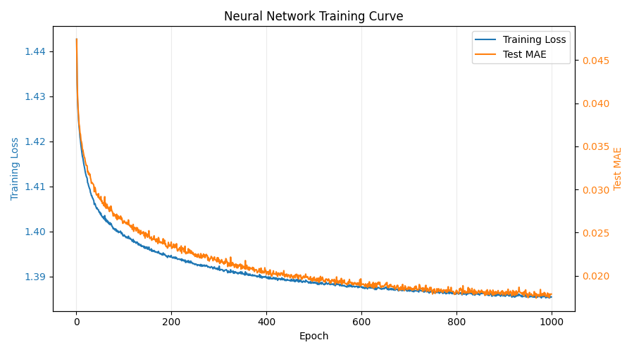
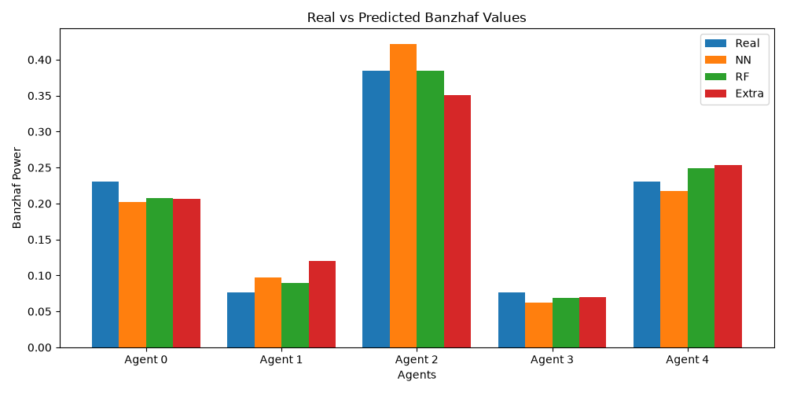

# InfluenceNet Mini — From-Scratch Banzhaf Prediction

This project is a small **2D from-scratch prototype inspired by InfluenceNet**.

It predicts **Banzhaf power indices** for weighted voting games using models implemented from scratch with only:

- Python
- NumPy
- Pandas
- Matplotlib

No scikit-learn, PyTorch, or TensorFlow is used.

---

## Project Idea

A weighted voting game has:

- several agents / voters
- one weight for each agent
- one quota

A coalition wins if the sum of its weights is at least the quota.

The **Banzhaf power index** measures how influential each agent is.  
An agent is powerful if adding it to a losing coalition often changes the result from losing to winning.

Exact Banzhaf calculation is possible for a small number of agents, but it becomes expensive when the number of agents increases because all possible coalitions must be checked.

The goal of this project is to train machine learning models that approximate the exact Banzhaf values from the voting game parameters.

---

## Relation to InfluenceNet

This project is inspired by the InfluenceNet idea:

> Use neural networks to approximate power indices instead of calculating them exactly every time.

However, this repository is currently a **simplified 2D version**.

In this project, each game is represented as a tabular feature vector:

```text
weights + quota + engineered features
```

The full InfluenceNet-style extension with **3D rule-based game representations / Marginal Contribution Networks** is planned as future work.

So this project should be understood as:

```text
A 2D weighted voting game prototype inspired by InfluenceNet.
```

---

## Models

This project compares three models implemented from scratch:

| Model                      | Explanation                                                                             |
| -------------------------- | --------------------------------------------------------------------------------------- |
| NumPy Neural Network       | Two hidden layers, ReLU activation, softmax output, mini-batch training, Adam optimizer |
| From-Scratch Random Forest | Many regression trees trained on bootstrap samples                                      |
| From-Scratch Extra Trees   | Many randomized regression trees with random thresholds                                 |

---

## Current Results

On the 2D test dataset, the models achieved approximately:

| Model                      | Test MAE |
| -------------------------- | -------: |
| NumPy Neural Network       |   0.0177 |
| From-Scratch Random Forest |   0.0352 |
| From-Scratch Extra Trees   |   0.0389 |

The neural network performs best overall on the full test set.

For one example voting game:

```python
example_weights = np.array([4, 2, 7, 1, 5])
example_quota = 10
```

The models correctly learn the general power structure:

```text
Agent 2 has the highest power.
Agents 0 and 4 have medium power.
Agents 1 and 3 have lower power.
```

---

## Visual Results

### Neural network training curve



This image is created by `train_models.py` and saved as:

```text
results/mlp_training_curve_2d.png
```

During training, the NumPy neural network records one row per epoch with:

* training loss
* test mean absolute error

The plot is generated from `results/mlp_training_history.csv` by `save_loss_curve()` in `src/plots.py`.

The blue line is the neural network training loss.  
The orange line is the test MAE, which measures the average absolute difference between predicted and exact Banzhaf values on the held-out test set.

Both lines flatten after training, which shows that the model has mostly stabilized. The two values use different scales, so the main point of this image is the trend over time, not a direct comparison between the blue and orange heights.

### Example prediction comparison



This image is created by `predict.py` and saved as:

```text
results/midterm_comparison.png
```

The example game is:

```python
example_weights = np.array([4, 2, 7, 1, 5])
example_quota = 10
```

The script builds this chart by:

1. calculating the exact Banzhaf values with `exact_banzhaf()`
2. creating the same engineered feature vector used during training
3. loading the saved neural network, random forest, and extra trees models from `models/`
4. predicting one Banzhaf value per agent for each model
5. writing the table, absolute errors, and chart into `results/`

In the chart, each agent has four bars:

| Bar   | Meaning |
| ----- | ------- |
| Real  | exact Banzhaf value from full coalition enumeration |
| NN    | prediction from the NumPy neural network |
| RF    | prediction from the from-scratch random forest |
| Extra | prediction from the from-scratch extra trees model |

Bars that are close together mean the model predicted that agent's power accurately. For this example, all three models recover the main structure: Agent 2 is the most powerful, Agents 0 and 4 are medium-power agents, and Agents 1 and 3 have lower power.

The exact values and predictions are also saved in:

```text
results/example_prediction_table.csv
results/example_prediction_errors.csv
```

---

## Folder Structure

```text
influencenet_from_scratch/
├── data/
│   └── midterm_2d_data.csv
├── models/
│   ├── mlp_numpy_2d.npz
│   ├── random_forest_scratch.pkl
│   └── extra_trees_scratch.pkl
├── results/
│   ├── mlp_training_curve_2d.png
│   ├── mlp_training_history.csv
│   ├── model_metrics_2d.csv
│   ├── example_prediction_table.csv
│   ├── example_prediction_errors.csv
│   └── midterm_comparison.png
├── src/
│   ├── __init__.py
│   ├── banzhaf.py
│   ├── features.py
│   ├── nn.py
│   ├── plots.py
│   ├── scaler.py
│   └── trees.py
├── generate_data.py
├── train_models.py
├── predict.py
├── requirements.txt
├── .gitignore
└── README.md
```

---

## Setup

Create and activate a virtual environment:

```bash
python3 -m venv .venv
source .venv/bin/activate
```

Install requirements:

```bash
pip install -r requirements.txt
```

---

## Run the Project

### 1. Generate the dataset

```bash
python3 generate_data.py
```

This creates:

```text
data/midterm_2d_data.csv
```

You can also control the dataset size and seed:

```bash
python3 generate_data.py --num-games 20000 --seed 42
```

---

### 2. Train the models

```bash
python3 train_models.py
```

This trains:

* NumPy Neural Network
* From-Scratch Random Forest
* From-Scratch Extra Trees

It saves the trained models in:

```text
models/
```

Expected saved model files:

```text
models/mlp_numpy_2d.npz
models/random_forest_scratch.pkl
models/extra_trees_scratch.pkl
```

It also saves metrics and plots in:

```text
results/
```

Useful saved files include:

```text
results/model_metrics_2d.csv
results/mlp_training_history.csv
results/mlp_training_curve_2d.png
```

---

### 3. Run one example prediction

```bash
python3 predict.py
```

The example uses:

```python
example_weights = np.array([4, 2, 7, 1, 5])
example_quota = 10
```

The script prints:

* exact Banzhaf values
* neural network prediction
* random forest prediction
* extra trees prediction

You can also test a custom voting game:

```bash
python3 predict.py --weights 4 2 7 1 5 --quota 10
```

It also saves prediction artifacts:

```text
results/example_prediction_table.csv
results/example_prediction_errors.csv
results/midterm_comparison.png
```

---

## Example Output

```text
--- Midterm Example Prediction ---
  Agent   Real     NN     RF  Extra
Agent 0 0.2308 0.2784 0.1986 0.2216
Agent 1 0.0769 0.0715 0.0788 0.1137
Agent 2 0.3846 0.3708 0.4007 0.3584
Agent 3 0.0769 0.0559 0.0719 0.0823
Agent 4 0.2308 0.2234 0.2501 0.2240
```

This shows that all models learned the main power structure of the voting game.

---

## What to Say in a Presentation

### Simple explanation

> In this project, I use machine learning to approximate Banzhaf power indices. The exact calculation checks all possible coalitions, which becomes expensive when the number of agents grows. I generate many small weighted voting games, calculate the exact Banzhaf values, and train models to predict them from the weights, quota, and engineered features.

### Relation to the paper

> This project is inspired by InfluenceNet. The paper uses neural networks to approximate power indices in more complex cooperative games. For the midterm, I implemented a simplified 2D weighted voting game version. This lets me focus on the core idea: learning to approximate Banzhaf values using models implemented from scratch.

### What changed from the old version?

> The old version only used one simple neural network prediction. In the new version, I compare three models: a NumPy neural network, a from-scratch Random Forest, and a from-scratch Extra Trees model. I also added engineered features, train/test evaluation, prediction plots, and saved model files.

### Why softmax in the neural network?

> The Banzhaf values are normalized, so they are non-negative and sum to 1. Softmax helps the neural network output values in the same distribution format.

### Why Random Forest and Extra Trees?

> They are useful baselines. They use many decision trees and average their predictions. Random Forest uses bootstrap samples, while Extra Trees adds more randomness by choosing random split thresholds.

### Why 2D now and 3D later?

> For the midterm, I use a 2D tabular representation with weights and quota. This is easier to explain and enough to demonstrate the main idea. For the final project, I can extend the system to 3D rule-based game representations, which would be closer to the full InfluenceNet paper.

---

## Notes

The models in this repository are educational implementations.
They are not optimized like scikit-learn, but their internal logic is visible and easier to explain.

For better accuracy, increase:

* number of generated games in `generate_data.py`
* `epochs` in `train_models.py`
* `n_estimators` in `train_models.py`

For faster training, reduce those values.

---

## Future Work

Possible extensions:

* add more agents
* compare with scikit-learn models
* add Shapley-Shubik index prediction
* implement Monte Carlo Banzhaf approximation for larger games
* extend from 2D weighted voting games to 3D rule-based Marginal Contribution Networks
* add more detailed benchmark plots
* package the project as an educational open-source toolkit

---
