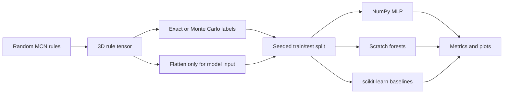

# InfluenceNet Mini: 3D Rule-Based Marginal Contribution Networks

This project is an educational implementation of power-index prediction for cooperative games. It now supports the paper-style **rule-based Marginal Contribution Network (MCN)** representation from `InfluenceNet AI Models for Banzhaf and Shapley Value Prediction.pdf`.

The original weighted-voting workflow is still available, but the main workflow is now MCN:

```text
dataset axis 1: games
dataset axis 2: rules inside each game
dataset axis 3: required agents + banned agents + rule value
```

In code, one MCN dataset is stored as:

```text
rules.shape == (num_games, num_rules, 2 * num_agents + 1)
```

For example, with 8 agents and 20 rules:

```text
rules.shape == (num_games, 20, 17)
```

The last dimension has 17 columns because it stores:

```text
8 required-agent flags + 8 banned-agent flags + 1 rule value
```


## Table Of Contents

- [What This Project Does](#what-this-project-does)
- [Beginner Explanation](#beginner-explanation)
- [MCN Rule Tensor](#mcn-rule-tensor)
- [Power Indices](#power-indices)
- [How The Code Works](#how-the-code-works)
- [Install Locally](#install-locally)
- [Run The MCN Workflow](#run-the-mcn-workflow)
- [Run The Old Weighted-Voting Workflow](#run-the-old-weighted-voting-workflow)
- [Generated Files And Images](#generated-files-and-images)
- [Python API Examples](#python-api-examples)
- [Project Structure](#project-structure)
- [Reproducibility And Limits](#reproducibility-and-limits)
- [Troubleshooting](#troubleshooting)

## What This Project Does

The project answers this question:

> Given a cooperative game, how much influence does each agent have?

It can:

- generate random MCN games using the paper's rule-generation styles;
- compute Banzhaf and Shapley-style labels exactly for small MCNs;
- approximate MCN labels with Monte Carlo sampling for larger MCNs;
- train from-scratch and scikit-learn regressors to predict power indices;
- save model comparison tables and charts;
- compare exact and predicted power on one example game;
- still run the earlier 2D weighted-voting experiments.

## Beginner Explanation

### Agents

An **agent** is one participant in a game. In political voting, an agent could be a party. In a company, an agent could be a board member. In a network, an agent could be a node.

### Coalition

A **coalition** is a group of agents working together. If there are 3 agents named `a`, `b`, and `c`, then these are possible coalitions:

```text
{}
{a}
{b}
{c}
{a, b}
{a, c}
{b, c}
{a, b, c}
```

With `n` agents there are `2^n` possible coalitions, so exact calculation becomes expensive quickly.

### Weighted Voting Game

The old version of this project used weighted voting games. A game looked like this:

```text
[quota; weight_0, weight_1, ..., weight_n]
```

A coalition wins when its total weight is at least the quota.

### Marginal Contribution Network

An MCN does not use only weights and a quota. Instead, it uses **rules**.

A rule says:

```text
if these agents are present
and these other agents are absent
then add this rule value to the coalition
```

That makes MCNs more expressive than simple weighted voting games. They can represent positive interactions, exclusions, and local rule patterns.

## MCN Rule Tensor

Each rule has three parts:

| Part | Meaning |
| --- | --- |
| `req_*` | agents that must be in the coalition |
| `ban_*` | agents that must not be in the coalition |
| `value` | score added when the rule is satisfied |

The PDF gives this example:

```text
{a and b}      -> 3
{a and not c} -> 1
{b and not c} -> 2
```

With agents `a=0`, `b=1`, and `c=2`, the rule matrix is:

| Rule | req_0 | req_1 | req_2 | ban_0 | ban_1 | ban_2 | value |
| --- | ---: | ---: | ---: | ---: | ---: | ---: | ---: |
| 0 | 1 | 1 | 0 | 0 | 0 | 0 | 3 |
| 1 | 1 | 0 | 0 | 0 | 0 | 1 | 1 |
| 2 | 0 | 1 | 0 | 0 | 0 | 1 | 2 |

Coalition values:

| Coalition | Satisfied rules | Value |
| --- | --- | ---: |
| `{a}` | `{a and not c}` | 1 |
| `{b}` | `{b and not c}` | 2 |
| `{a, b}` | all three rules | 6 |
| `{a, c}` | none | 0 |

The generated MCN example plot shows this same structure visually:


If the image is missing, run:

```bash
python train_models.py --data data/mcn_games.npz --game-type mcn
python predict.py --game-type mcn --data data/mcn_games.npz
```

## Power Indices

Power indices measure how important each agent is.

### Banzhaf

Banzhaf asks:

> How often does this agent change the value of a coalition?

For MCNs in this project, the default label follows the paper's unsigned rule-change idea: an agent gets influence when adding it either activates a rule or breaks a rule. Breaking a rule matters because banned agents can remove value from a coalition.

### Shapley--Shubik

Shapley--Shubik asks:

> If agents join one at a time in random order, how much does each agent contribute when it joins?

For MCNs, the project samples or enumerates orderings and measures each agent's marginal contribution.

### Exact Versus Monte Carlo

Exact labels are best for small games because they enumerate every coalition. The cost grows exponentially with the number of agents.

Monte Carlo labels are better for larger games because they sample coalitions and orderings instead of checking all of them.

Use exact labels for small local examples:

```bash
python generate_data.py \
  --game-type mcn \
  --num-games 500 \
  --num-agents 6 \
  --num-rules 12 \
  --label-method exact
```

Use Monte Carlo labels when agent counts get larger:

```bash
python generate_data.py \
  --game-type mcn \
  --label-method monte_carlo \
  --monte-carlo-samples 10000
```

## How The Code Works


```mermaid
flowchart LR
    A[Random MCN rules] --> B[3D rule tensor]
    B --> C[Exact or Monte Carlo labels]
    B --> D[Flatten only for model input]
    C --> E[Seeded train/test split]
    D --> E
    E --> F[NumPy MLP]
    E --> G[Scratch forests]
    E --> H[scikit-learn baselines]
    F --> I[Metrics and plots]
    G --> I
    H --> I
```

The stored MCN dataset is truly 3D:

```text
num_games x num_rules x (2 * num_agents + 1)
```

The neural networks and tree models receive a flattened copy:

```text
num_games x flattened_rule_columns
```

That flattening is only the model handoff. The source data, saved dataset, validation, exact labels, and prediction example all use the rule-based MCN representation.

### Random Rule Generators

The code implements the three rule-generation families described in the paper:

| Option | Meaning |
| --- | --- |
| `uniform` | sample required and banned flags from uniform random values |
| `coin_flip` | choose agents by repeated coin-like assignments |
| `gaussian_mixture` | sample rule patterns from per-rule Gaussian distributions |

Use them with:

```bash
python generate_data.py --game-type mcn --rule-generator uniform
python generate_data.py --game-type mcn --rule-generator coin_flip
python generate_data.py --game-type mcn --rule-generator gaussian_mixture
```

### Rule Value Generators

The code also implements the paper's three rule-value styles:

| Option | Meaning |
| --- | --- |
| `uniform` | every rule has value `1` |
| `low_variance` | rule values are close to each other |
| `high_variance` | rule values vary much more strongly |

Use them with:

```bash
python generate_data.py --game-type mcn --value-generator uniform
python generate_data.py --game-type mcn --value-generator low_variance
python generate_data.py --game-type mcn --value-generator high_variance
```

### Models

The MCN NumPy MLP follows the paper more closely than the old weighted-game model:

```text
input -> 512 -> 256 -> 128 -> output
```

It uses:

- ReLU hidden layers;
- 20 percent dropout for MCN training;
- linear output;
- MSE loss.

The project also trains:

- from-scratch Random Forest;
- from-scratch Extra Trees;
- scikit-learn MLP;
- scikit-learn Random Forest;
- scikit-learn Extra Trees.

## Install Locally

### Prerequisites

You need:

- Python 3.10 or newer;
- Git, if you are cloning the project;
- a terminal.

### Get The Code

If you are cloning from a remote repository:

```bash
git clone https://github.com/mohammad-kawach/power-index-learning
cd influencenet_from_scratch
```

If the project folder already exists on your machine, open a terminal in that folder instead.

### Linux, macOS, or WSL

```bash
python3 -m venv .venv
source .venv/bin/activate
python -m pip install --upgrade pip
python -m pip install -r requirements.txt
```

### Windows PowerShell

```powershell
py -3 -m venv .venv
.\.venv\Scripts\Activate.ps1
python -m pip install --upgrade pip
python -m pip install -r requirements.txt
```

If PowerShell blocks activation:

```powershell
Set-ExecutionPolicy -Scope Process -ExecutionPolicy Bypass
.\.venv\Scripts\Activate.ps1
```

### Windows Command Prompt

```bat
py -3 -m venv .venv
.venv\Scripts\activate.bat
python -m pip install --upgrade pip
python -m pip install -r requirements.txt
```

### Verify The Install

After activation:

```bash
python -c "import numpy, pandas, matplotlib, sklearn; print('environment ready')"
python -m unittest discover -s tests -v
```

If `python` is not available before activation on Linux, use:

```bash
python3 -m unittest discover -s tests -v
```

Inside this repository's existing environment, this also works:

```bash
.venv/bin/python -m unittest discover -s tests -v
```

## Run The MCN Workflow

### 1. Generate A Small MCN Dataset

Start small so the whole pipeline finishes quickly:

```bash
python generate_data.py \
  --game-type mcn \
  --num-games 500 \
  --num-agents 6 \
  --num-rules 12 \
  --rule-generator uniform \
  --value-generator uniform \
  --label-method exact \
  --seed 42 \
  --output data/mcn_games.npz
```

This creates:

```text
data/mcn_games.npz
```

The archive contains:

```text
rules
banzhaf_targets
shapley_targets
metadata such as num_agents, num_rules, seed, and generators
```

### 2. Train Models

For a quick local run:

```bash
python train_models.py \
  --data data/mcn_games.npz \
  --game-type mcn \
  --epochs 20 \
  --sklearn-max-iter 50 \
  --n-estimators 5
```

For a stronger run, increase the values gradually:

```bash
python train_models.py \
  --data data/mcn_games.npz \
  --game-type mcn \
  --epochs 300 \
  --sklearn-max-iter 300 \
  --n-estimators 40
```

Train only one target if you want:

```bash
python train_models.py --data data/mcn_games.npz --game-type mcn --indices banzhaf
python train_models.py --data data/mcn_games.npz --game-type mcn --indices shapley
```

### 3. Predict One MCN Example

Use one game from the generated dataset:

```bash
python predict.py \
  --game-type mcn \
  --data data/mcn_games.npz \
  --example-index 0
```

Or generate a fresh deterministic MCN example with the same shape used during training:

```bash
python predict.py \
  --game-type mcn \
  --num-agents 6 \
  --num-rules 12 \
  --rule-generator uniform \
  --value-generator uniform \
  --seed 123
```

Important: the prediction example must use the same `num_agents` and `num_rules` as the trained model.

### 4. Larger MCN Dataset With Monte Carlo Labels

Exact labels get slow as agents increase. For larger examples:

```bash
python generate_data.py \
  --game-type mcn \
  --num-games 2000 \
  --num-agents 12 \
  --num-rules 20 \
  --rule-generator coin_flip \
  --value-generator high_variance \
  --label-method monte_carlo \
  --monte-carlo-samples 10000 \
  --output data/mcn_games.npz
```

Then train as usual:

```bash
python train_models.py --data data/mcn_games.npz --game-type mcn
```

## Run The Old Weighted-Voting Workflow

Weighted voting is still supported for comparison and for the original project behavior.

Generate data:

```bash
python generate_data.py \
  --game-type weighted \
  --num-games 20000 \
  --num-agents 8 \
  --seed 42 \
  --output data/voting_games.csv
```

Train:

```bash
python train_models.py \
  --data data/voting_games.csv \
  --game-type weighted \
  --epochs 300 \
  --sklearn-max-iter 300 \
  --n-estimators 40
```

Predict one weighted game:

```bash
python predict.py \
  --game-type weighted \
  --weights 4 2 7 1 5 3 6 2 \
  --quota 16
```

Run the weighted-game Monte Carlo demo:

```bash
python monte_carlo_demo.py \
  --weights 4 2 7 1 5 3 6 2 \
  --quota 16 \
  --samples 10000 \
  --seed 42
```

## Generated Files And Images

Generated datasets and models can become large. The `.gitignore` ignores generated data and model binaries. PNG result figures are intentionally allowed so they can be committed when you want the README to show them.

### MCN Data

```text
data/
└── mcn_games.npz
```

### MCN Models

```text
models/
├── mcn_banzhaf_numpy_mlp.npz
├── mcn_banzhaf_scratch_random_forest.pkl
├── mcn_banzhaf_scratch_extra_trees.pkl
├── mcn_banzhaf_sklearn_mlp.pkl
├── mcn_banzhaf_sklearn_random_forest.pkl
├── mcn_banzhaf_sklearn_extra_trees.pkl
├── mcn_shapley_numpy_mlp.npz
├── mcn_shapley_scratch_random_forest.pkl
├── mcn_shapley_scratch_extra_trees.pkl
├── mcn_shapley_sklearn_mlp.pkl
├── mcn_shapley_sklearn_random_forest.pkl
└── mcn_shapley_sklearn_extra_trees.pkl
```

### MCN Reports

```text
results/
├── mcn_model_metrics.csv
├── mcn_banzhaf_numpy_mlp_history.csv
├── mcn_shapley_numpy_mlp_history.csv
├── example_mcn_rules.csv
├── example_mcn_banzhaf_predictions.csv
├── example_mcn_banzhaf_errors.csv
├── example_mcn_shapley_predictions.csv
└── example_mcn_shapley_errors.csv
```

### MCN Images

These images demonstrate the full MCN workflow. If any of them are missing, run:

```bash
python train_models.py --data data/mcn_games.npz --game-type mcn
python predict.py --game-type mcn --data data/mcn_games.npz --example-index 0
```

#### Overall Model Accuracy


#### Banzhaf Prediction Quality


#### Shapley Prediction Quality


#### One MCN Example


All image files above are saved in `results/`.

### Weighted-Voting Images

These are generated by the weighted workflow and Monte Carlo demo:


<table>
  <tr>
    <th>Weighted Banzhaf predicted vs exact</th>
    <th>Weighted Shapley predicted vs exact</th>
  </tr>
  <tr>
    <td></td>
    <td></td>
  </tr>
  <tr>
    <th>Weighted Banzhaf per-agent MAE</th>
    <th>Weighted Shapley per-agent MAE</th>
  </tr>
  <tr>
    <td></td>
    <td></td>
  </tr>
  <tr>
    <th>Weighted Banzhaf NumPy MLP training</th>
    <th>Weighted Shapley NumPy MLP training</th>
  </tr>
  <tr>
    <td></td>
    <td></td>
  </tr>
</table>

Weighted prediction example:

<table>
  <tr>
    <th>Example weighted Banzhaf comparison</th>
    <th>Example weighted Shapley comparison</th>
  </tr>
  <tr>
    <td></td>
    <td></td>
  </tr>
  <tr>
    <th>Example weighted Banzhaf errors</th>
    <th>Example weighted Shapley errors</th>
  </tr>
  <tr>
    <td></td>
    <td></td>
  </tr>
</table>

Monte Carlo weighted-game uncertainty:


## Python API Examples

### Evaluate One MCN By Hand

```python
import numpy as np

from src.mcn import coalition_value, exact_power_indices

rules = np.array([
    [1, 1, 0, 0, 0, 0, 3],
    [1, 0, 0, 0, 0, 1, 1],
    [0, 1, 0, 0, 0, 1, 2],
], dtype=float)

print(coalition_value([1, 0, 0], rules))  # {a} -> 1
print(coalition_value([0, 1, 0], rules))  # {b} -> 2
print(coalition_value([1, 1, 0], rules))  # {a, b} -> 6

result = exact_power_indices(rules)
print(result.banzhaf)
print(result.shapley)
```

### Generate One Random MCN Rule Matrix

```python
import numpy as np

from src.mcn import generate_random_rules

rng = np.random.default_rng(42)
rules = generate_random_rules(
    num_rules=20,
    num_agents=8,
    rng=rng,
    rule_generator="uniform",
    value_generator="low_variance",
    p=0.5,
)

print(rules.shape)  # (20, 17)
```

### Approximate MCN Labels With Monte Carlo

```python
from src.mcn import monte_carlo_power_indices

result = monte_carlo_power_indices(
    rules,
    num_samples=10000,
    seed=42,
)

print(result.banzhaf)
print(result.shapley)
```

## Project Structure

| Path | Responsibility |
| --- | --- |
| `src/mcn.py` | MCN rule tensors, coalition values, exact labels, Monte Carlo labels, random MCN generation |
| `src/banzhaf.py` | weighted-voting exact indices and weighted-game Monte Carlo Banzhaf |
| `src/features.py` | weighted-game feature engineering and MCN tensor flattening |
| `src/nn.py` | flexible from-scratch NumPy MLP for weighted and MCN workflows |
| `src/trees.py` | from-scratch Random Forest and Extra Trees regressors |
| `src/scaler.py` | from-scratch standard scaling |
| `src/plots.py` | headless Matplotlib charts, including MCN rule heatmaps |
| `generate_data.py` | CLI for weighted CSV or MCN `.npz` dataset generation |
| `train_models.py` | shared train/test split, model training, metrics, and plots |
| `predict.py` | exact-versus-predicted comparison for one weighted or MCN game |
| `monte_carlo_demo.py` | weighted-game Monte Carlo confidence interval demo |
| `tests/` | unit tests for weighted games, MCN rules, features, and sampling |

## Reproducibility And Limits

- Seeds control dataset generation, sampling, train/test splitting, and model initialization.
- Exact MCN labels still grow exponentially with agent count.
- Monte Carlo labels trade exactness for speed.
- MCN output labels are normalized influence distributions by default.
- The project uses unsigned MCN marginal changes by default, matching the paper's fulfilled-or-broken rule influence idea.
- The NumPy MLP is educational and readable, not optimized like PyTorch or JAX.
- The scikit-learn baselines can produce tiny differences across package versions.
- A model trained on one MCN shape cannot predict a different MCN shape. Keep `num_agents` and `num_rules` the same.

## Troubleshooting

| Problem | Fix |
| --- | --- |
| `python: command not found` | activate `.venv`; on Linux before activation use `python3` |
| `No module named numpy` | run `python -m pip install -r requirements.txt` inside the virtual environment |
| `data/mcn_games.npz not found` | run the MCN `generate_data.py` command first |
| missing `mcn_*.npz` or `mcn_*.pkl` models | run `train_models.py --data data/mcn_games.npz --game-type mcn` |
| prediction feature-count error | use the same `num_agents` and `num_rules` used for training |
| exact generation is slow | reduce `num_agents`, reduce `num_games`, or use `--label-method monte_carlo` |
| plots fail on a server | plotting uses the headless `Agg` backend, so no display server is required |
| PowerShell blocks activation | run `Set-ExecutionPolicy -Scope Process -ExecutionPolicy Bypass` and activate again |

## Local Install And Run Quickstart

Use this section if you only want to install the project on a local computer and run it.

### 1. Download The Project

If you are cloning from GitHub or another Git server:

```bash
git clone <repository-url>
cd influencenet_from_scratch
```

If you already have the project folder, open a terminal inside that folder.

### 2. Create A Python Environment

Linux, macOS, or WSL:

```bash
python3 -m venv .venv
source .venv/bin/activate
python -m pip install --upgrade pip
python -m pip install -r requirements.txt
```

Windows PowerShell:

```powershell
py -3 -m venv .venv
.\.venv\Scripts\Activate.ps1
python -m pip install --upgrade pip
python -m pip install -r requirements.txt
```

Windows Command Prompt:

```bat
py -3 -m venv .venv
.venv\Scripts\activate.bat
python -m pip install --upgrade pip
python -m pip install -r requirements.txt
```

### 3. Check That Installation Worked

```bash
python -c "import numpy, pandas, matplotlib, sklearn; print('ready')"
python -m unittest discover -s tests -v
```

### 4. Run The MCN Project Locally

Generate a small local MCN dataset:

```bash
python generate_data.py --game-type mcn --num-games 500 --num-agents 6 --num-rules 12 --output data/mcn_games.npz
```

For a faster 12-agent local run, use fewer Monte Carlo samples first:

```bash
python generate_data.py \
  --game-type mcn \
  --num-games 500 \
  --num-agents 12 \
  --num-rules 20 \
  --rule-generator coin_flip \
  --value-generator high_variance \
  --label-method monte_carlo \
  --monte-carlo-samples 2000 \
  --output data/mcn_games.npz
```

The larger command with `--num-games 2000` and `--monte-carlo-samples 10000` is much more expensive. Use it only when you want a higher-quality generated dataset and are willing to wait.

Train the models:

```bash
python train_models.py --data data/mcn_games.npz --game-type mcn --epochs 20 --sklearn-max-iter 50 --n-estimators 5
```

Run prediction on one generated MCN game:

```bash
python predict.py --game-type mcn --data data/mcn_games.npz --example-index 0
```

The generated outputs will be saved in:

```text
data/
models/
results/
```

Open the PNG files in `results/` to see the generated charts.
