# InfluenceNet Mini

Educational power-index prediction for cooperative games, with a focus on
rule-based **Marginal Contribution Networks (MCNs)**.

The project can generate cooperative games, compute Banzhaf and
Shapley--Shubik style labels, train from-scratch and scikit-learn regressors,
and compare exact versus predicted influence scores. The older weighted-voting
workflow is still available, but MCNs are the main path.

The MCN implementation follows the representation described in
[InfluenceNet AI Models for Banzhaf and Shapley Value Prediction](InfluenceNet%20AI%20Models%20for%20Banzhaf%20and%20Shapley%20Value%20Prediction.pdf).

## Contents

- [What This Project Does](#what-this-project-does)
- [Quickstart](#quickstart)
- [Beginner Concepts](#beginner-concepts)
- [MCN Rule Tensor](#mcn-rule-tensor)
- [Power Indices](#power-indices)
- [How The Code Works](#how-the-code-works)
- [Run MCN Experiments](#run-mcn-experiments)
- [Run Weighted-Voting Experiments](#run-weighted-voting-experiments)
- [Visual Guide](#visual-guide)
- [Generated Artifacts](#generated-artifacts)
- [Python API Examples](#python-api-examples)
- [Project Structure](#project-structure)
- [Reproducibility And Limits](#reproducibility-and-limits)
- [Troubleshooting](#troubleshooting)

## What This Project Does

The central question is:

> Given a cooperative game, how much influence does each agent have?

This repository can:

- generate random MCN games using paper-style rule generators;
- compute exact Banzhaf and Shapley--Shubik labels for small MCNs;
- approximate labels with Monte Carlo sampling for larger MCNs;
- train NumPy neural networks, from-scratch tree ensembles, and scikit-learn baselines;
- save comparison metrics, model files, prediction tables, and plots;
- run the original weighted-voting experiments for comparison.

## Quickstart

### 1. Install

Requirements:

- Python 3.9 or newer;
- Git, if you are cloning the repository;
- a terminal.

```bash
git clone https://github.com/mohammad-kawach/power-index-learning.git
cd power-index-learning

python3 --version
python3 -m venv .venv
source .venv/bin/activate
python -m pip install --upgrade pip
python -m pip install -r requirements.txt
```

If `python3 --version` prints Python 3.8 or older, install Python 3.9+ and
replace `python3` in the commands above with the newer executable, such as
`python3.9`.

On Windows PowerShell:

```powershell
py -3 --version
py -3 -m venv .venv
.\.venv\Scripts\Activate.ps1
python -m pip install --upgrade pip
python -m pip install -r requirements.txt
```

If `py -3 --version` selects Python 3.8 or older, use a newer launcher target
instead, such as `py -3.9`.

If PowerShell blocks activation, run:

```powershell
Set-ExecutionPolicy -Scope Process -ExecutionPolicy Bypass
.\.venv\Scripts\Activate.ps1
```

### 2. Verify

```bash
python -c "import numpy, pandas, matplotlib, sklearn; print('environment ready')"
python -m unittest discover -s tests -v
```

### 3. Generate A Small MCN Dataset

```bash
python generate_data.py \
  --game-type mcn \
  --num-games 500 \
  --num-agents 6 \
  --num-rules 12 \
  --rule-generator uniform \
  --value-generator uniform \
  --label-method exact \
  --seed 42 \
  --output data/mcn_games.npz
```

This creates a compressed NumPy archive containing:

```text
rules
banzhaf_targets
shapley_targets
metadata such as num_agents, num_rules, seed, and generators
```

### 4. Train

```bash
python train_models.py \
  --data data/mcn_games.npz \
  --game-type mcn \
  --epochs 20 \
  --sklearn-max-iter 50 \
  --n-estimators 5
```

### 5. Predict One Example

```bash
python predict.py \
  --game-type mcn \
  --data data/mcn_games.npz \
  --example-index 0
```

Important: MCN prediction uses the same input width as training. Keep
`num_agents` and `num_rules` unchanged between dataset generation, training,
and prediction.

## Beginner Concepts

### Agents

An **agent** is one participant in a cooperative game. In political voting, an
agent could be a party. In a company, an agent could be a board member. In a
network, an agent could be a node.

### Coalitions

A **coalition** is a group of agents working together. With agents `a`, `b`,
and `c`, the possible coalitions are:

```text
{}
{a}
{b}
{c}
{a, b}
{a, c}
{b, c}
{a, b, c}
```

With `n` agents there are `2^n` possible coalitions, so exact calculation gets
expensive quickly.

### Weighted Voting

The older workflow represents a game as:

```text
[quota; weight_0, weight_1, ..., weight_n]
```

A coalition wins when its total weight is at least the quota.

### Marginal Contribution Networks

An MCN uses rules instead of only weights and a quota:

```text
if these agents are present
and these other agents are absent
then add this rule value to the coalition
```

That makes MCNs more expressive than simple weighted voting games. They can
represent positive interactions, exclusions, and local rule patterns.

## MCN Rule Tensor

One MCN dataset is stored as a real 3D tensor:

```text
rules.shape == (num_games, num_rules, 2 * num_agents + 1)
```

For example, with 8 agents and 20 rules:

```text
rules.shape == (num_games, 20, 17)
```

The last dimension has 17 columns because it stores:

```text
8 required-agent flags + 8 banned-agent flags + 1 rule value
```

Each rule has three parts:

| Part | Meaning |
| --- | --- |
| `req_*` | agents that must be in the coalition |
| `ban_*` | agents that must not be in the coalition |
| `value` | score added when the rule is satisfied |

Example with agents `a=0`, `b=1`, and `c=2`:

```text
{a and b}      -> 3
{a and not c} -> 1
{b and not c} -> 2
```

| Rule | req_0 | req_1 | req_2 | ban_0 | ban_1 | ban_2 | value |
| --- | ---: | ---: | ---: | ---: | ---: | ---: | ---: |
| 0 | 1 | 1 | 0 | 0 | 0 | 0 | 3 |
| 1 | 1 | 0 | 0 | 0 | 0 | 1 | 1 |
| 2 | 0 | 1 | 0 | 0 | 0 | 1 | 2 |

Coalition values:

| Coalition | Satisfied rules | Value |
| --- | --- | ---: |
| `{a}` | `{a and not c}` | 1 |
| `{b}` | `{b and not c}` | 2 |
| `{a, b}` | all three rules | 6 |
| `{a, c}` | none | 0 |

The visual guide below includes a generated heatmap that shows this same
structure for one full MCN example.

## Power Indices

Power indices measure how important each agent is.

### Banzhaf

Banzhaf asks:

> How often does this agent change the value of a coalition?

For MCNs, the default label follows the paper's unsigned rule-change idea: an
agent receives influence when adding it either activates a rule or breaks a
rule. Breaking a rule matters because banned agents can remove value from a
coalition.

### Shapley--Shubik

Shapley--Shubik asks:

> If agents join one at a time in random order, how much does each agent
> contribute when it joins?

The project can compute this exactly for small MCNs or approximate it with
Monte Carlo sampling for larger ones.

## How The Code Works

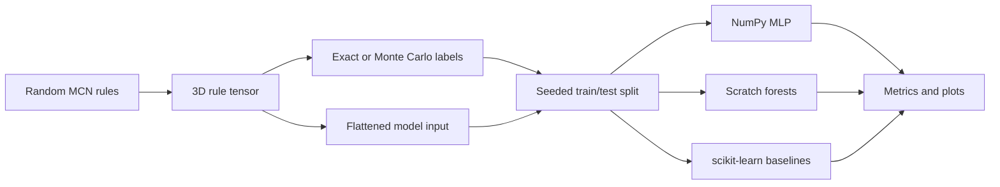
```mermaid
flowchart LR
    A[Random MCN rules] --> B[3D rule tensor]
    B --> C[Exact or Monte Carlo labels]
    B --> D[Flattened model input]
    C --> E[Seeded train/test split]
    D --> E
    E --> F[NumPy MLP]
    E --> G[Scratch forests]
    E --> H[scikit-learn baselines]
    F --> I[Metrics and plots]
    G --> I
    H --> I
```

The dataset, validation, exact labels, Monte Carlo labels, and prediction
example use the rule-based MCN representation. The rule tensor is flattened only
at the final model-input step because the current regressors expect 2D feature
matrices.

### Rule Generators

| Option | Meaning |
| --- | --- |
| `uniform` | sample required and banned flags from uniform random values |
| `coin_flip` | choose agents by repeated coin-like assignments |
| `gaussian_mixture` | sample rule patterns from per-rule Gaussian distributions |

Use them with:

```bash
python generate_data.py --game-type mcn --rule-generator uniform
python generate_data.py --game-type mcn --rule-generator coin_flip
python generate_data.py --game-type mcn --rule-generator gaussian_mixture
```

### Rule Value Generators

| Option | Meaning |
| --- | --- |
| `uniform` | every rule has value `1` |
| `low_variance` | rule values are close to each other |
| `high_variance` | rule values vary much more strongly |

Use them with:

```bash
python generate_data.py --game-type mcn --value-generator uniform
python generate_data.py --game-type mcn --value-generator low_variance
python generate_data.py --game-type mcn --value-generator high_variance
```

### Models

For MCNs, the NumPy MLP uses:

```text
input -> 512 -> 256 -> 128 -> output
```

The project also trains:

- from-scratch Random Forest;
- from-scratch Extra Trees;
- scikit-learn MLP;
- scikit-learn Random Forest;
- scikit-learn Extra Trees.

## Run MCN Experiments

### Exact Labels For Small Games

```bash
python generate_data.py \
  --game-type mcn \
  --num-games 500 \
  --num-agents 6 \
  --num-rules 12 \
  --label-method exact \
  --output data/mcn_games.npz
```

### Monte Carlo Labels For Larger Games

Exact labels scale exponentially with the number of agents. For larger examples,
sample labels instead:

```bash
python generate_data.py \
  --game-type mcn \
  --num-games 2000 \
  --num-agents 12 \
  --num-rules 20 \
  --rule-generator coin_flip \
  --value-generator high_variance \
  --label-method monte_carlo \
  --monte-carlo-samples 10000 \
  --output data/mcn_games.npz
```

For a faster local trial, reduce `--num-games` and `--monte-carlo-samples`.

### Train One Or Both Targets

```bash
python train_models.py --data data/mcn_games.npz --game-type mcn
python train_models.py --data data/mcn_games.npz --game-type mcn --indices banzhaf
python train_models.py --data data/mcn_games.npz --game-type mcn --indices shapley
```

### Predict From A Dataset Example

```bash
python predict.py \
  --game-type mcn \
  --data data/mcn_games.npz \
  --example-index 0
```

### Predict From A Fresh MCN With The Trained Shape

```bash
python predict.py \
  --game-type mcn \
  --num-agents 6 \
  --num-rules 12 \
  --rule-generator uniform \
  --value-generator uniform \
  --seed 123
```

## Run Weighted-Voting Experiments

Generate weighted-voting data:

```bash
python generate_data.py \
  --game-type weighted \
  --num-games 20000 \
  --num-agents 8 \
  --seed 42 \
  --output data/voting_games.csv
```

Train weighted-voting models:

```bash
python train_models.py \
  --data data/voting_games.csv \
  --game-type weighted \
  --epochs 300 \
  --sklearn-max-iter 300 \
  --n-estimators 40
```

Predict one weighted game:

```bash
python predict.py \
  --game-type weighted \
  --weights 4 2 7 1 5 3 6 2 \
  --quota 16
```

Run the weighted-game Monte Carlo demo:

```bash
python monte_carlo_demo.py \
  --weights 4 2 7 1 5 3 6 2 \
  --quota 16 \
  --samples 10000 \
  --seed 42
```

## Visual Guide

These plots are saved in `results/`. Together they show what the MCN data looks
like, how the labels behave, how the models perform, and what happens on one
concrete example game.

### MCN Rule Complexity

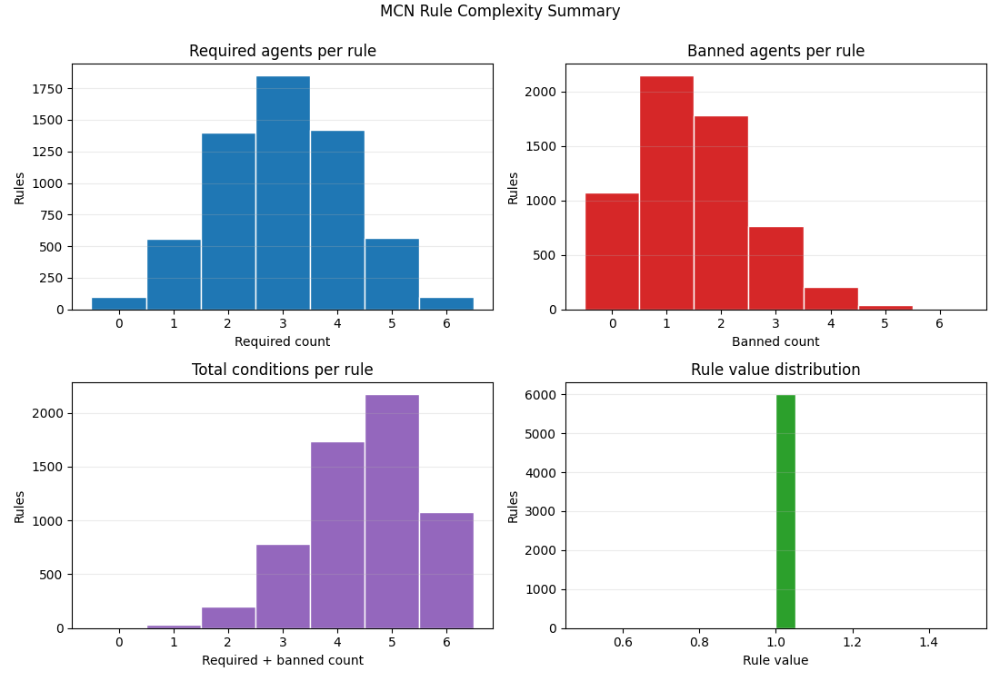

This chart explains the generated rule dataset before any model is trained. The
first three panels show how many agents are required, banned, or mentioned at
all in each rule. The final panel shows the rule-value distribution. With the
default `uniform` value generator, all rule values are `1`, so the value
histogram correctly collapses into one spike.

### Agent Role Frequency

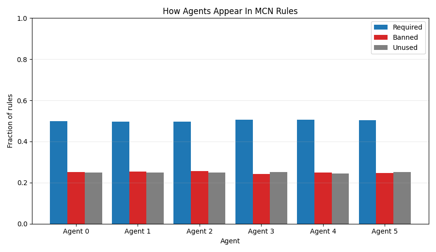

This chart checks whether the generator treats agents evenly. Each group of
bars shows how often an agent is required, banned, or unused across all rules.
For a symmetric generator, the bars should be broadly similar across agents.

### Target Distribution

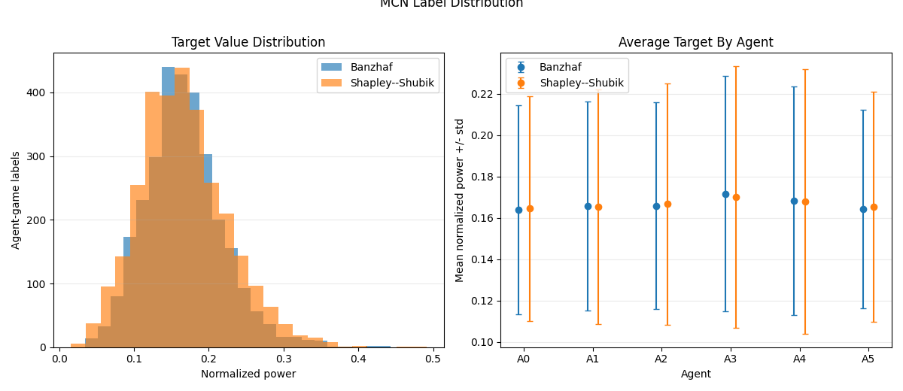

This chart shows the training labels. The histogram shows all normalized
agent-game target values, while the right panel shows each agent's average
label and standard deviation. It helps reveal whether the dataset is balanced
or dominated by a few high-power agents.

### Banzhaf Versus Shapley Labels

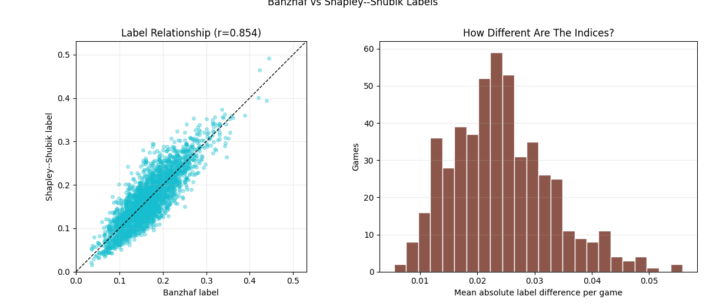

This plot compares the two target definitions directly. Points near the dashed
line mean Banzhaf and Shapley--Shubik assign similar power to the same
agent-game pair. The histogram shows how different the two label vectors are
inside each game.

### Model MAE Comparison

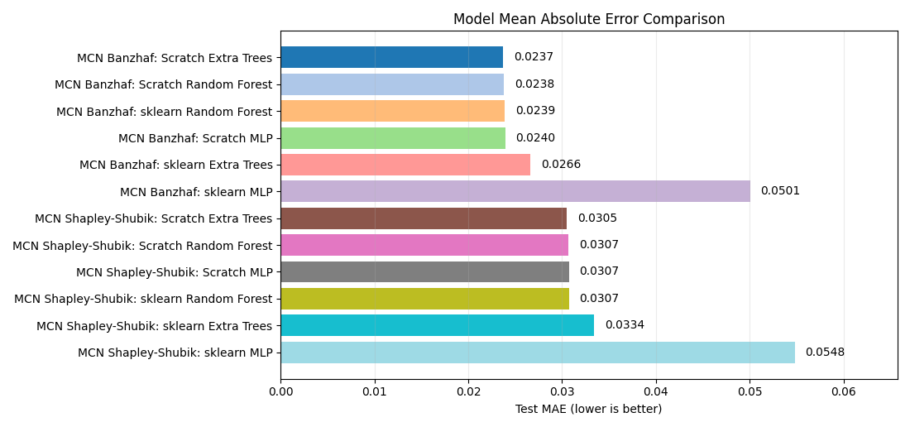

This is the model leaderboard. Each bar is a test mean absolute error, so lower
is better. It compares the NumPy MLP, scratch tree ensembles, and scikit-learn
baselines for both Banzhaf and Shapley--Shubik targets.

### Banzhaf Prediction Scatter

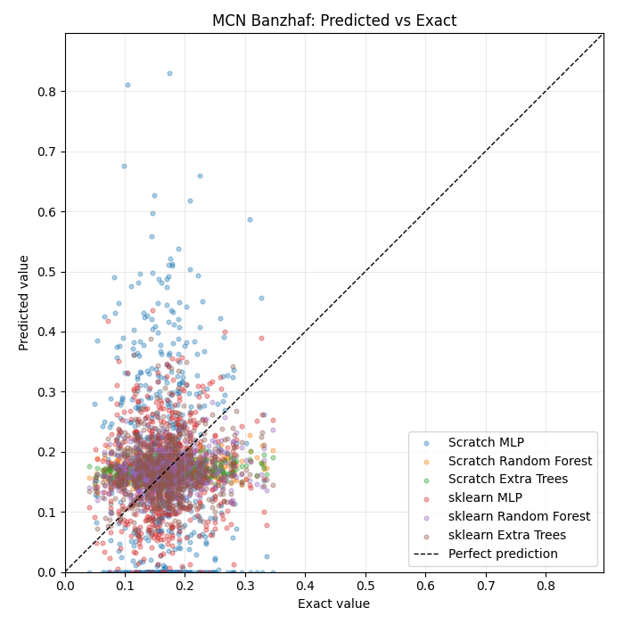

Each point is one predicted Banzhaf value for one agent in one test game. The
dashed diagonal is perfect prediction. Points tightly clustered around that
line mean the model is matching the exact labels well.

### Banzhaf Per-Agent Error

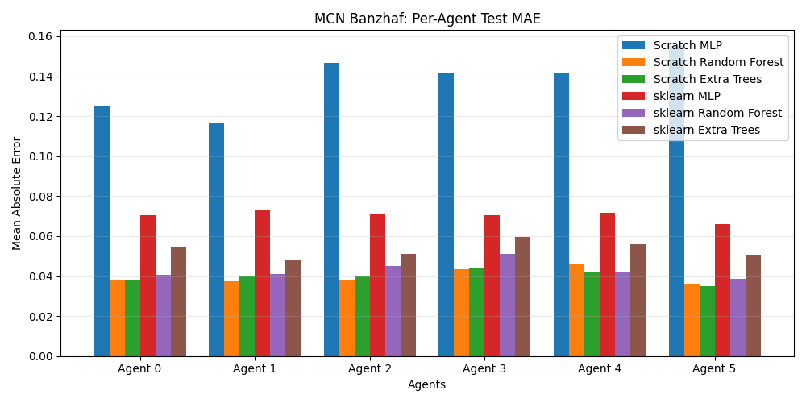

This chart breaks Banzhaf error down by agent. It helps catch cases where a
model has a good average score but consistently misses one particular agent
position.

### Banzhaf Training Curve

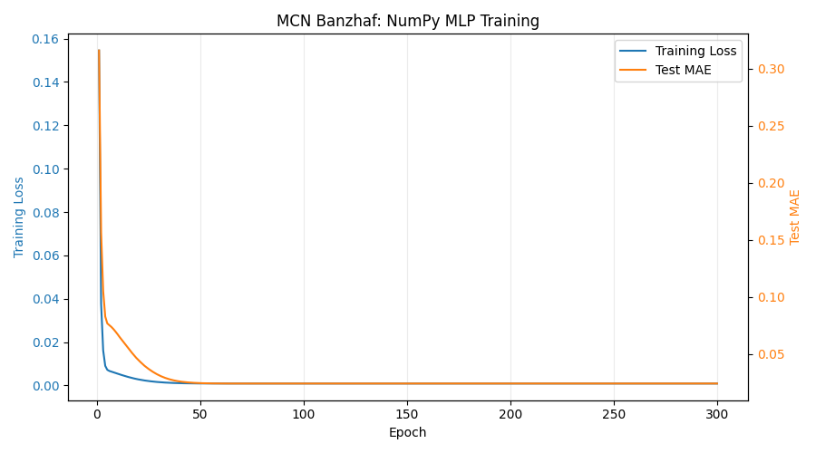

This chart follows the NumPy MLP during Banzhaf training. The loss line shows
optimization progress on the training set, while the test MAE line shows
whether that progress generalizes.

### Shapley Prediction Scatter

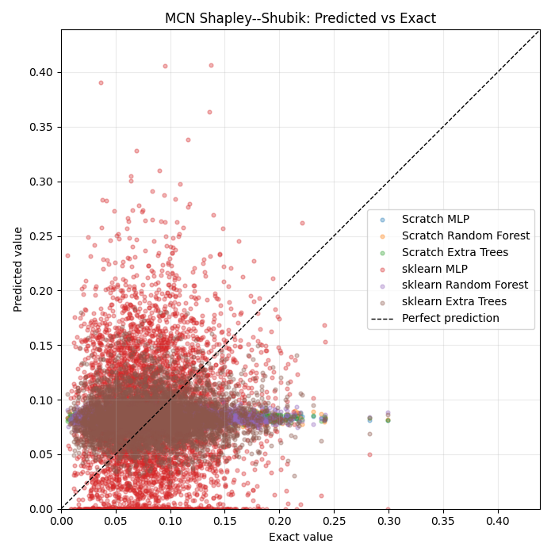

This is the same scatter diagnostic for Shapley--Shubik labels. Shapley labels
come from ordered marginal contributions, so this plot checks whether models
learn that second target as well as they learn Banzhaf.

### Shapley Per-Agent Error

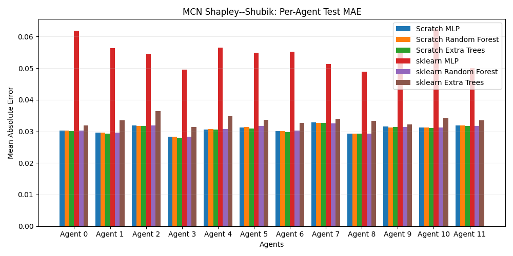

This chart shows Shapley--Shubik error by agent. It is useful for spotting
agent-specific bias that may be hidden in the overall MAE leaderboard.

### Shapley Training Curve

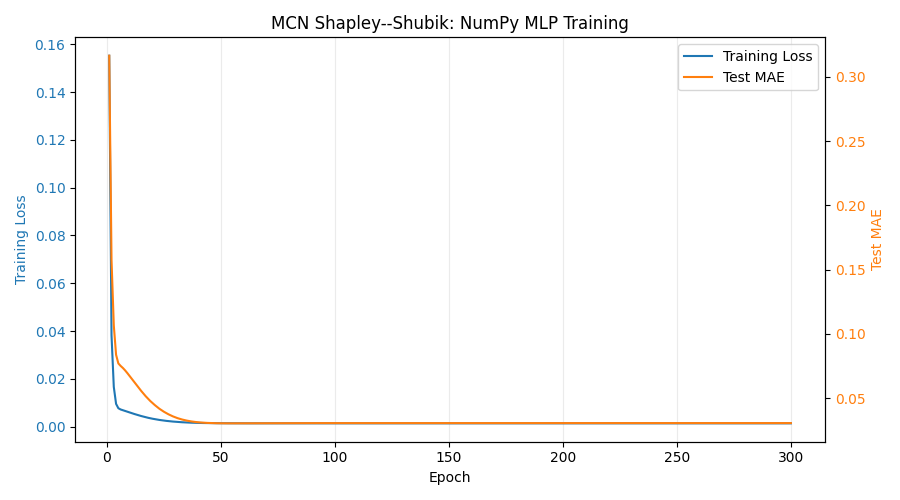

This chart tracks the NumPy MLP while it learns Shapley--Shubik targets. A
healthy run usually shows training loss falling without test MAE exploding.

### Example MCN Rule Heatmap

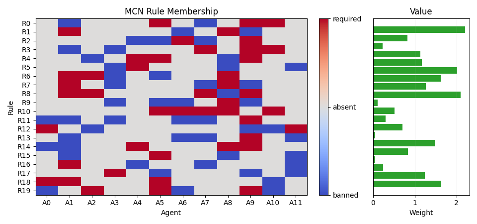

This plot shows one concrete MCN rule matrix. Blue cells are required agents,
red cells are banned agents, and neutral cells are agents not mentioned by that
rule. The green side bars show each rule's value.

### Example MCN Exact Power

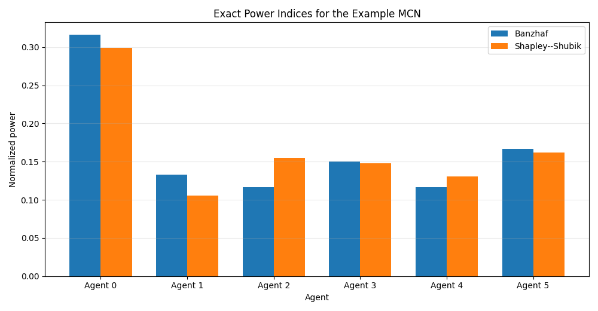

This plot compares exact Banzhaf and Shapley--Shubik power on the same example
MCN. Differences between the blue and orange bars show where coalition-based
and order-based marginal contribution views disagree.

### Example Banzhaf Prediction

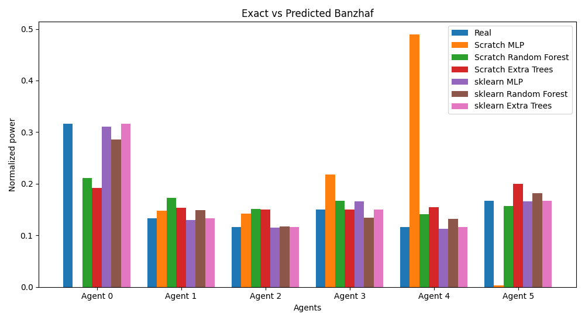

This chart compares exact Banzhaf power against every trained predictor for
one example game. It is easier to inspect than the full scatter plot because it
shows the predictions agent by agent.

### Example Banzhaf Error

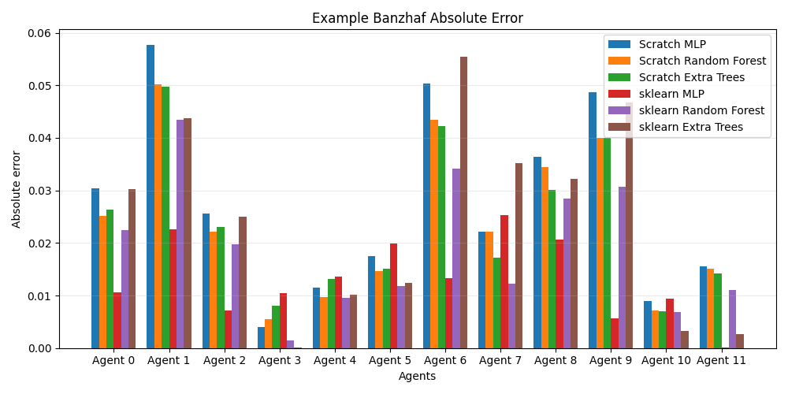

This chart shows the absolute Banzhaf prediction error for each agent in the
example game. Shorter bars mean the model was closer to the exact value.

### Example Shapley Prediction

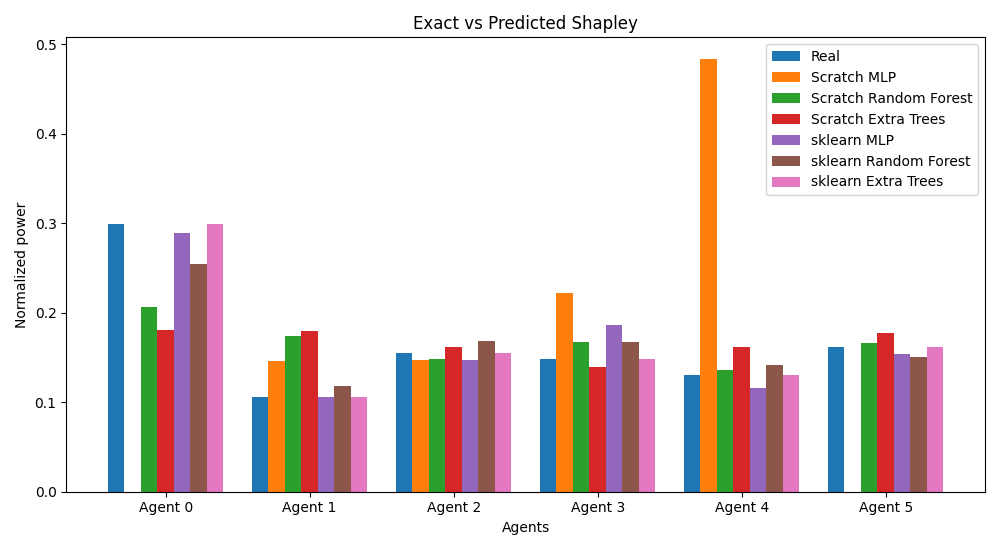

This is the same single-game comparison for Shapley--Shubik power. It shows
whether the trained models preserve the exact Shapley ranking of agents.

### Example Shapley Error

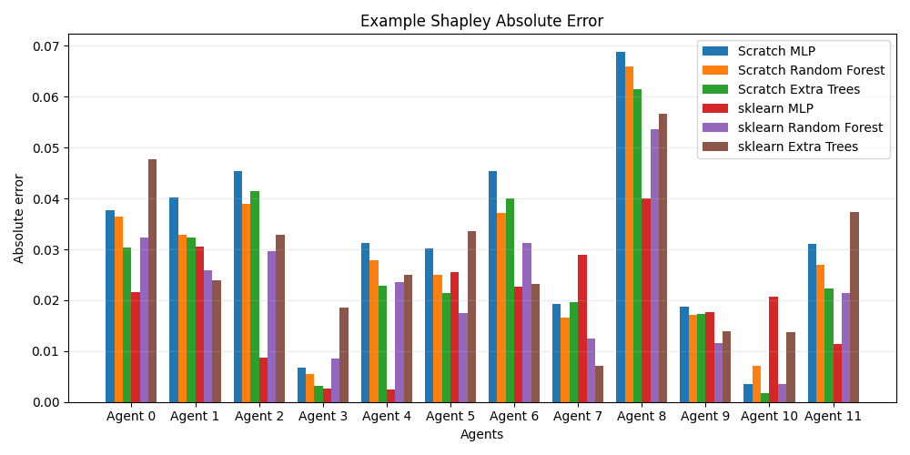

This chart shows the absolute Shapley--Shubik prediction error per agent for
the example game. It makes the largest misses visible immediately.

### Weighted-Game Exact Power

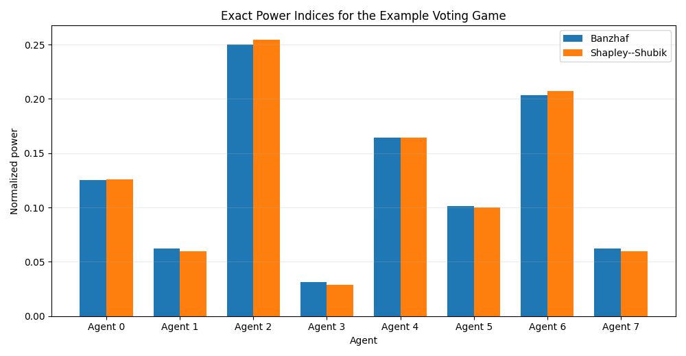

This plot belongs to the older weighted-voting workflow. It shows exact
Banzhaf and Shapley--Shubik scores for one weighted game, giving a simple
baseline before moving to MCNs.

### Weighted Monte Carlo Uncertainty

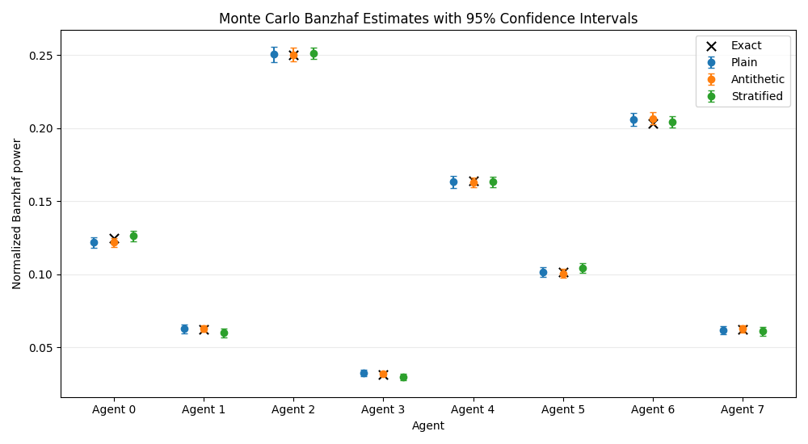

This chart shows Monte Carlo Banzhaf estimates with confidence intervals for
the weighted-game demo. It explains the uncertainty introduced when the project
uses sampling instead of exact enumeration.

## Generated Artifacts

Generated datasets and models can become large. The `.gitignore` excludes
generated data, model binaries, CSV reports, and text reports. PNG figures in
`results/` are intentionally versioned so the README can display them.

### MCN Data

```text
data/mcn_games.npz
```

The archive contains a 3D `rules` tensor, normalized Banzhaf targets,
normalized Shapley targets, and dataset metadata.

### MCN Models

```text
models/mcn_banzhaf_numpy_mlp.npz
models/mcn_banzhaf_scratch_random_forest.pkl
models/mcn_banzhaf_scratch_extra_trees.pkl
models/mcn_banzhaf_sklearn_mlp.pkl
models/mcn_banzhaf_sklearn_random_forest.pkl
models/mcn_banzhaf_sklearn_extra_trees.pkl
models/mcn_shapley_numpy_mlp.npz
models/mcn_shapley_scratch_random_forest.pkl
models/mcn_shapley_scratch_extra_trees.pkl
models/mcn_shapley_sklearn_mlp.pkl
models/mcn_shapley_sklearn_random_forest.pkl
models/mcn_shapley_sklearn_extra_trees.pkl
```

### MCN Reports And Images

```text
results/mcn_model_metrics.csv
results/mcn_rule_complexity.png
results/mcn_agent_role_frequency.png
results/mcn_target_distribution.png
results/mcn_index_relationship.png
results/mcn_model_mae_comparison.png
results/mcn_banzhaf_prediction_scatter.png
results/mcn_banzhaf_per_agent_mae.png
results/mcn_banzhaf_numpy_mlp_training.png
results/mcn_shapley_prediction_scatter.png
results/mcn_shapley_per_agent_mae.png
results/mcn_shapley_numpy_mlp_training.png
results/example_mcn_rules.png
results/example_mcn_exact_power.png
results/example_mcn_banzhaf_comparison.png
results/example_mcn_banzhaf_errors.png
results/example_mcn_shapley_comparison.png
results/example_mcn_shapley_errors.png
```

## Python API Examples

### Evaluate One MCN By Hand

```python
import numpy as np

from src.mcn import coalition_value, exact_power_indices

rules = np.array([
    [1, 1, 0, 0, 0, 0, 3],
    [1, 0, 0, 0, 0, 1, 1],
    [0, 1, 0, 0, 0, 1, 2],
], dtype=float)

print(coalition_value([1, 0, 0], rules))  # {a} -> 1
print(coalition_value([0, 1, 0], rules))  # {b} -> 2
print(coalition_value([1, 1, 0], rules))  # {a, b} -> 6

result = exact_power_indices(rules)
print(result.banzhaf)
print(result.shapley)
```

### Generate One Random MCN Rule Matrix

```python
import numpy as np

from src.mcn import generate_random_rules

rng = np.random.default_rng(42)
rules = generate_random_rules(
    num_rules=20,
    num_agents=8,
    rng=rng,
    rule_generator="uniform",
    value_generator="low_variance",
    p=0.5,
)

print(rules.shape)  # (20, 17)
```

### Approximate MCN Labels With Monte Carlo

```python
from src.mcn import monte_carlo_power_indices

result = monte_carlo_power_indices(
    rules,
    num_samples=10000,
    seed=42,
)

print(result.banzhaf)
print(result.shapley)
```

## Project Structure

| Path | Responsibility |
| --- | --- |
| `src/mcn.py` | MCN rule tensors, coalition values, exact labels, Monte Carlo labels, random MCN generation |
| `src/banzhaf.py` | weighted-voting exact indices and weighted-game Monte Carlo Banzhaf |
| `src/features.py` | weighted-game feature engineering and MCN tensor flattening |
| `src/nn.py` | from-scratch NumPy MLP |
| `src/trees.py` | from-scratch Random Forest and Extra Trees regressors |
| `src/scaler.py` | from-scratch standard scaling |
| `src/plots.py` | headless Matplotlib charts, including MCN rule heatmaps |
| `generate_data.py` | CLI for weighted CSV or MCN `.npz` dataset generation |
| `train_models.py` | model training, metrics, and plots |
| `predict.py` | exact-versus-predicted comparison for one weighted or MCN game |
| `monte_carlo_demo.py` | weighted-game Monte Carlo confidence interval demo |
| `tests/` | unit tests for weighted games, MCN rules, features, and sampling |

## Reproducibility And Limits

- Seeds control dataset generation, sampling, train/test splitting, and model initialization.
- Exact MCN labels grow exponentially with agent count.
- Monte Carlo labels trade exactness for speed.
- MCN output labels are normalized influence distributions by default.
- The MCN default uses unsigned marginal changes, matching the paper's fulfilled-or-broken rule influence idea.
- The NumPy MLP is educational and readable, not optimized like PyTorch or JAX.
- scikit-learn baselines can produce tiny differences across package versions.
- A model trained on one MCN shape cannot predict a different MCN shape.

## Troubleshooting

| Problem | Fix |
| --- | --- |
| `python: command not found` | Activate `.venv`; on Linux/macOS before activation, use `python3` |
| `No module named numpy` | Run `python -m pip install -r requirements.txt` inside the virtual environment |
| `data/mcn_games.npz not found` | Run the MCN `generate_data.py` command first |
| missing `mcn_*.npz` or `mcn_*.pkl` models | Run `train_models.py --data data/mcn_games.npz --game-type mcn` |
| prediction feature-count error | Use the same `num_agents` and `num_rules` used for training |
| exact generation is slow | Reduce `num_agents`, reduce `num_games`, or use `--label-method monte_carlo` |
| plots fail on a server | Plotting uses Matplotlib's headless `Agg` backend, so no display server is required |
| PowerShell blocks activation | Run `Set-ExecutionPolicy -Scope Process -ExecutionPolicy Bypass`, then activate again |
