# InfluenceNet Mini: Learning Power Indices

A reproducible, educational toolkit for calculating and learning power in weighted voting games. It computes exact **Banzhaf** and **Shapley--Shubik** indices, estimates Banzhaf power with Monte Carlo confidence intervals, and compares six multi-output regressors across from-scratch and scikit-learn implementations.

> This repository is a tabular prototype inspired by [InfluenceNet](https://arxiv.org/abs/2503.08381). It is not a reproduction of the paper's full Marginal Contribution Network architecture.


## Highlights

| Capability | Included implementation |
| --- | --- |
| Exact power | exhaustive Banzhaf and Shapley--Shubik enumeration |
| Scalable estimation | plain, antithetic, and coalition-size-stratified Monte Carlo Banzhaf |
| Uncertainty | standard errors and configurable normal-approximation confidence intervals |
| From-scratch models | NumPy MLP, Random Forest, and Extra Trees |
| Matched baselines | scikit-learn MLP, Random Forest, and Extra Trees |
| Configurable games | dynamic agent count; the reference experiment uses 8 agents |
| Reproducibility | seeded data generation, sampling, splitting, and model training |
| Evaluation | overall MAE, per-agent MAE, predicted-vs-exact scatter, and example errors |

No GPU is required. The project runs on Linux, macOS, Windows, and Windows Subsystem for Linux with Python 3.10 or newer.

## Contents

- [How it works](#how-it-works)
- [Power indices](#power-indices)
- [Reference results](#reference-results)
- [Install on Linux, macOS, or Windows](#install-on-linux-macos-or-windows)
- [Run the project](#run-the-project)
- [Monte Carlo API](#monte-carlo-api)
- [Generated files](#generated-files)
- [Project structure](#project-structure)
- [Reproducibility and limitations](#reproducibility-and-limitations)
- [Troubleshooting](#troubleshooting)

## How it works

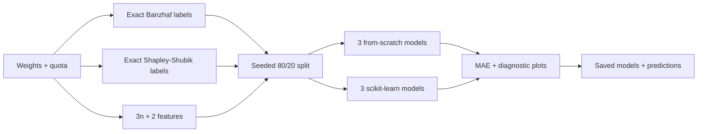
```mermaid
flowchart LR
    A[Weights + quota] --> B[Exact Banzhaf labels]
    A --> C[Exact Shapley-Shubik labels]
    A --> D[3n + 2 features]
    B --> E[Seeded 80/20 split]
    C --> E
    D --> E
    E --> F[3 from-scratch models]
    E --> G[3 scikit-learn models]
    F --> H[MAE + diagnostic plots]
    G --> H
    H --> I[Saved models + predictions]
```

For a game with `n` agents, each model receives `3n + 2` features:

1. `n` raw weights;
2. the quota;
3. `n` weights divided by total weight;
4. `n` weights divided by the quota;
5. quota divided by total weight.

The default eight-agent experiment therefore has 26 input features and predicts an eight-value power distribution. Banzhaf and Shapley--Shubik use separate models; outputs are projected to non-negative vectors that sum to one before evaluation.

## Power indices

A weighted voting game is written as `[q; w_1, ..., w_n]`. A coalition `S` wins when:

```text
sum(w_i for i in S) >= q
```

Agent `i` is critical, or has a *swing*, when a coalition loses without `i` and wins after `i` joins.

### Normalized Banzhaf power

The raw Banzhaf score is the fraction of coalitions of the other agents for which the agent is critical. This project normalizes the raw scores so that the agents' power sums to one.

### Shapley--Shubik power

The Shapley--Shubik index is the probability that an agent is pivotal in a uniformly random ordering. A swing coalition of size `s` receives weight:

```text
s! (n - s - 1)! / n!
```

Exact enumeration costs `O(n 2^n)`. It is practical for the moderate games used to generate training labels; use the Monte Carlo estimator when exact Banzhaf computation becomes too expensive.

## Reference results

The committed figures are a transparent reference run of the current pipeline: 20,000 generated eight-agent games, a deterministic 80/20 split, 300 MLP epochs, and 40 trees per ensemble. **Lower MAE is better.** Re-running with different dependency versions or arguments can change the values.

| Power index | Model | Implementation | Test MAE |
| --- | --- | --- | ---: |
| Banzhaf | MLP | from scratch | **0.0169** |
| Banzhaf | MLP | scikit-learn | 0.0216 |
| Banzhaf | Extra Trees | scikit-learn | 0.0219 |
| Banzhaf | Random Forest | scikit-learn | 0.0244 |
| Banzhaf | Random Forest | from scratch | 0.0271 |
| Banzhaf | Extra Trees | from scratch | 0.0287 |
| Shapley--Shubik | MLP | from scratch | **0.0189** |
| Shapley--Shubik | Extra Trees | scikit-learn | 0.0232 |
| Shapley--Shubik | MLP | scikit-learn | 0.0233 |
| Shapley--Shubik | Random Forest | scikit-learn | 0.0261 |
| Shapley--Shubik | Random Forest | from scratch | 0.0286 |
| Shapley--Shubik | Extra Trees | from scratch | 0.0307 |

### Overall model comparison

This chart compares all six models on both targets using the same held-out games and MAE calculation.

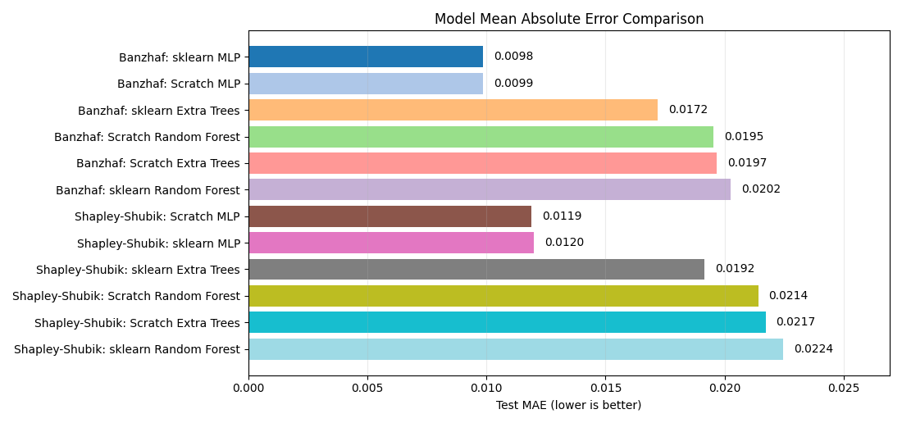

### Predicted versus exact values

Points on the dashed diagonal are perfect predictions. These plots reveal calibration and difficult high-power cases that one average score can hide.

<table>
  <tr>
    <th>Banzhaf</th>
    <th>Shapley--Shubik</th>
  </tr>
  <tr>
    <td>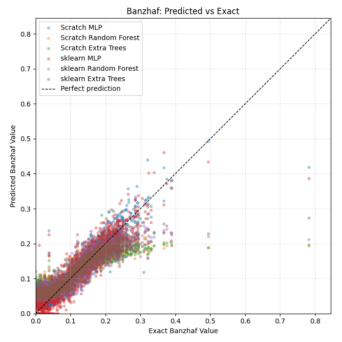</td>
    <td>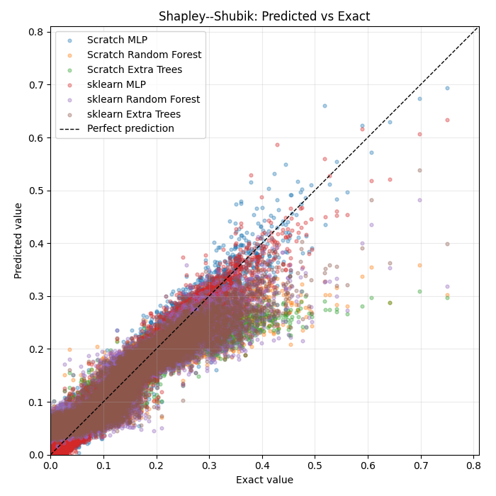</td>
  </tr>
</table>

### Error by agent position

Per-agent plots check whether a model's aggregate MAE hides a position-specific weakness.

<table>
  <tr>
    <th>Banzhaf per-agent MAE</th>
    <th>Shapley--Shubik per-agent MAE</th>
  </tr>
  <tr>
    <td>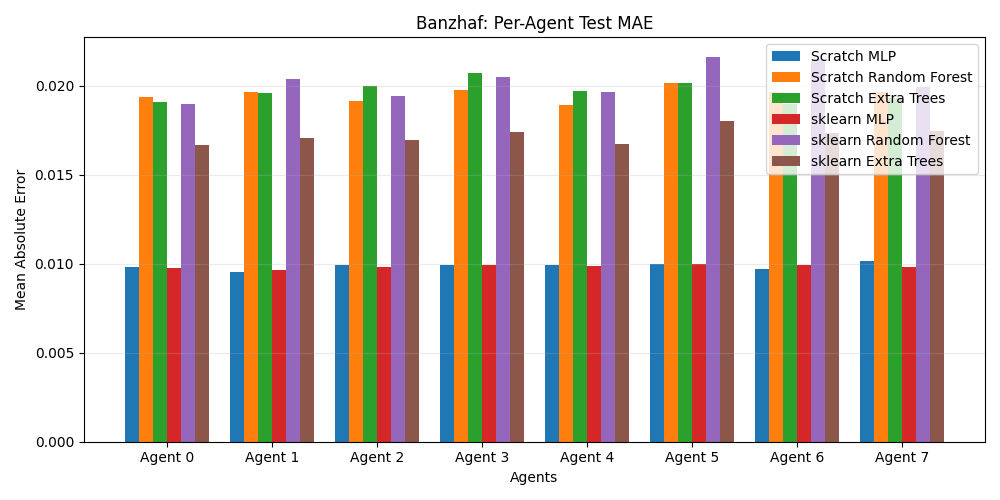</td>
    <td>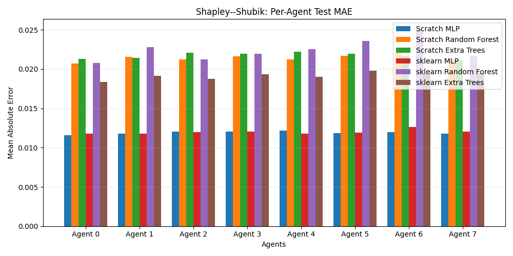</td>
  </tr>
</table>

### NumPy MLP learning curves

Training loss and held-out MAE flatten for both independently trained target models. They use separate vertical scales because cross-entropy training loss and MAE are different quantities.

<table>
  <tr>
    <th>Banzhaf training</th>
    <th>Shapley--Shubik training</th>
  </tr>
  <tr>
    <td>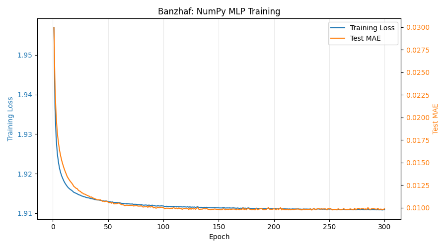</td>
    <td>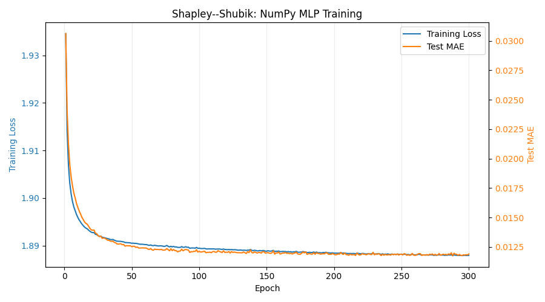</td>
  </tr>
</table>

### One-game prediction comparison

The example game is `[16; 4, 2, 7, 1, 5, 3, 6, 2]`. The first pair of charts compares exact power with every model; the second pair exposes each absolute error directly.

<table>
  <tr>
    <th>Banzhaf: exact versus predicted</th>
    <th>Shapley--Shubik: exact versus predicted</th>
  </tr>
  <tr>
    <td>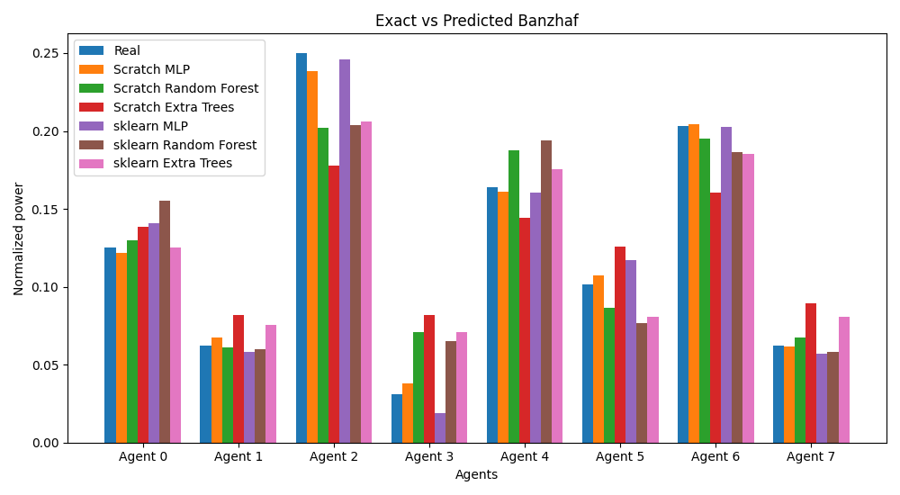</td>
    <td>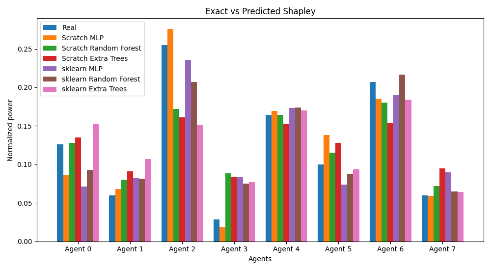</td>
  </tr>
  <tr>
    <th>Banzhaf absolute error</th>
    <th>Shapley--Shubik absolute error</th>
  </tr>
  <tr>
    <td>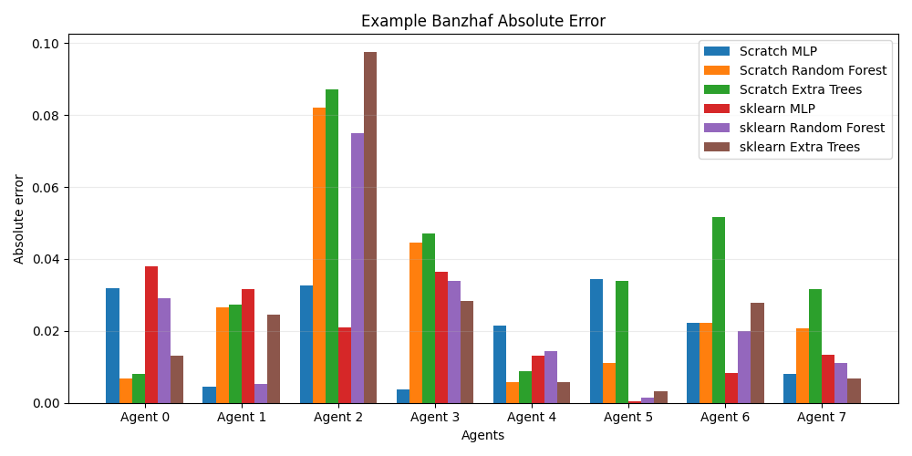</td>
    <td>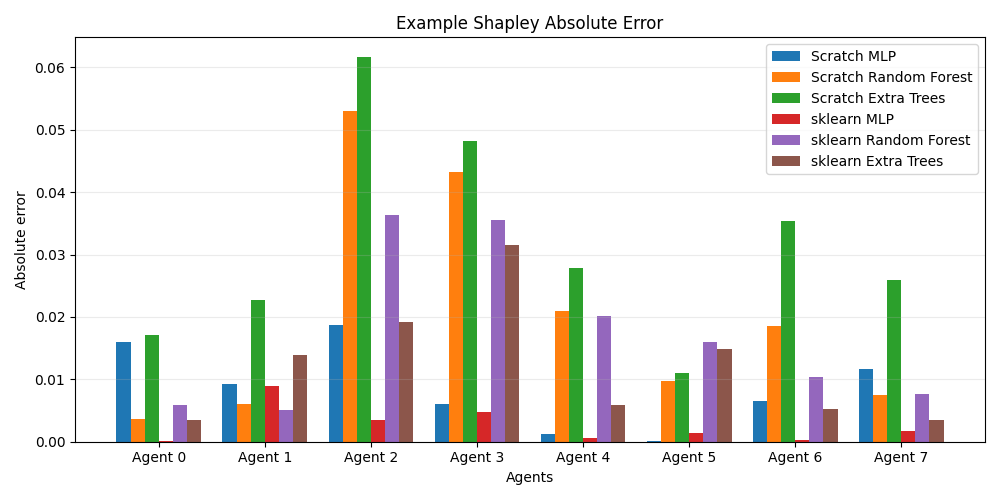</td>
  </tr>
</table>

### Monte Carlo methods and uncertainty

The black crosses are exact Banzhaf values. Colored points show the three estimators with 95% confidence intervals from 10,000 statistical samples.


| Method | Sampling design | Tradeoff |
| --- | --- | --- |
| `plain` | independent Bernoulli coalition membership | lowest computation per sample |
| `antithetic` | averages a coalition with its complement | two evaluations per statistical sample; often narrower intervals |
| `stratified` | samples separately at every coalition size | covers rare sizes; requires `num_samples >= n` |

## Install on Linux, macOS, or Windows

### Prerequisites

| Platform | Install first |
| --- | --- |
| Ubuntu / Debian | `sudo apt install git python3 python3-pip python3-venv` |
| Fedora / RHEL | `sudo dnf install git python3 python3-pip` |
| macOS | install Python 3 from [python.org](https://www.python.org/downloads/) or `brew install python git` |
| Windows | install Git and Python 3 from [python.org](https://www.python.org/downloads/windows/); enable **Add Python to PATH** |
| WSL | follow the Linux instructions inside the WSL terminal |

Python 3.10+ and Git are required. A virtual environment is strongly recommended so project packages do not modify the system Python.

### 1. Clone the repository

Run this on every platform, then keep the terminal in the repository root for all later commands:

```bash
git clone https://github.com/mohammad-kawach/power-index-learning.git
cd power-index-learning
```

### 2. Create the environment and install packages

#### Linux, macOS, and WSL

```bash
python3 -m venv .venv
source .venv/bin/activate
python -m pip install --upgrade pip
python -m pip install -r requirements.txt
```

#### Windows PowerShell

```powershell
py -3 -m venv .venv
.\.venv\Scripts\Activate.ps1
python -m pip install --upgrade pip
python -m pip install -r requirements.txt
```

If PowerShell blocks activation, allow scripts only for the current process and retry:

```powershell
Set-ExecutionPolicy -Scope Process -ExecutionPolicy Bypass
.\.venv\Scripts\Activate.ps1
```

#### Windows Command Prompt

```bat
py -3 -m venv .venv
.venv\Scripts\activate.bat
python -m pip install --upgrade pip
python -m pip install -r requirements.txt
```

After activation, all platforms can use `python`. The installed runtime packages are NumPy, pandas, Matplotlib, and scikit-learn.

### 3. Verify the installation

```bash
python -c "import numpy, pandas, matplotlib, sklearn; print('environment ready')"
python -m unittest discover -s tests -v
```

## Run the project

### Fast local smoke run

Use this smaller workflow first. It validates data generation, all six training paths, serialization, prediction, and plotting without the cost of the reference run.

```bash
python generate_data.py --num-games 500 --num-agents 8 --seed 42
python train_models.py --epochs 20 --sklearn-max-iter 50 --n-estimators 5
python predict.py
python monte_carlo_demo.py --samples 10000
```

The smoke run is for integration checking, not benchmark-quality accuracy.

### Full reproducible workflow

#### 1. Generate exact labels

```bash
python generate_data.py \
  --num-games 20000 \
  --num-agents 8 \
  --seed 42 \
  --output data/voting_games.csv
```

The CSV contains `weight_*`, `quota`, `banzhaf_target_*`, and `shapley_target_*` columns. Exact generation is exponential in agent count, so increasing `--num-agents` can sharply increase runtime.

#### 2. Train and compare all models

```bash
python train_models.py \
  --data data/voting_games.csv \
  --epochs 300 \
  --sklearn-max-iter 300 \
  --n-estimators 40
```

Useful alternatives:

```bash
# Train only one power-index target
python train_models.py --indices banzhaf
python train_models.py --indices shapley

# Show each from-scratch tree as it completes
python train_models.py --verbose
```

#### 3. Compare every model on one game

```bash
python predict.py
```

Or provide a custom game with the same number of agents used for training:

```bash
python predict.py --weights 4 2 7 1 5 3 6 2 --quota 16
```

A model trained with eight-agent rows cannot accept a different number of weights. Regenerate the dataset and retrain to change the model dimensions.

#### 4. Compare Monte Carlo estimators

```bash
python monte_carlo_demo.py \
  --weights 4 2 7 1 5 3 6 2 \
  --quota 16 \
  --samples 10000 \
  --seed 42
```

This step does not require a generated dataset or trained models.

#### 5. Run the test suite

```bash
python -m unittest discover -s tests -v
```

Tests cover known exact values, symmetric games, Monte Carlo accuracy and reproducibility, confidence intervals, all sampling methods, invalid inputs, dynamic feature width, and backward-compatible Banzhaf-only data.

### Main command options

| Script | Purpose | Important options |
| --- | --- | --- |
| `generate_data.py` | create exact labeled games | `--num-games`, `--num-agents`, `--seed`, `--output` |
| `train_models.py` | train and evaluate six models | `--indices`, `--epochs`, `--sklearn-max-iter`, `--n-estimators`, `--batch-size` |
| `predict.py` | compare exact and learned power | `--weights`, `--quota`, `--indices` |
| `monte_carlo_demo.py` | compare sampling estimators | `--weights`, `--quota`, `--samples`, `--seed` |

Run `python <script>.py --help` for the complete CLI reference.

## Monte Carlo API

The default call returns only the normalized estimate:

```python
from src.banzhaf import monte_carlo_banzhaf

power = monte_carlo_banzhaf(
    weights=[4, 2, 7, 1, 5, 3, 6, 2],
    quota=16,
    num_samples=10_000,
    seed=42,
)
```

Request a detailed result to inspect sampling uncertainty:

```python
result = monte_carlo_banzhaf(
    weights=[4, 2, 7, 1, 5, 3, 6, 2],
    quota=16,
    num_samples=10_000,
    seed=42,
    method="antithetic",       # plain | antithetic | stratified
    confidence_level=0.95,
    return_result=True,
)

print(result.estimate)
print(result.standard_error)
print(result.ci_low, result.ci_high)
```

`MonteCarloResult` also exposes `raw_estimate`, `raw_standard_error`, `num_samples`, `method`, and `confidence_level`. Normalized standard errors use the multivariate delta method; confidence intervals are clipped to `[0, 1]`. These are asymptotic intervals, so increase the sample count for rare swings or estimates near a boundary.

## Generated files

```text
data/
└── voting_games.csv
models/
├── banzhaf_numpy_mlp.npz
├── banzhaf_scratch_{random_forest,extra_trees}.pkl
├── banzhaf_sklearn_{mlp,random_forest,extra_trees}.pkl
├── shapley_numpy_mlp.npz
├── shapley_scratch_{random_forest,extra_trees}.pkl
└── shapley_sklearn_{mlp,random_forest,extra_trees}.pkl
results/
├── model_metrics.csv
├── model_mae_comparison.png
├── {banzhaf,shapley}_prediction_scatter.png
├── {banzhaf,shapley}_per_agent_mae.png
├── {banzhaf,shapley}_numpy_mlp_{history.csv,training.png}
├── example_{banzhaf,shapley}_{predictions,errors}.csv
├── example_{banzhaf,shapley}_{comparison,errors}.png
├── exact_power_indices.png
└── monte_carlo_confidence_intervals.{csv,png}
```

Datasets, model binaries, and CSV reports are ignored because they are generated and can grow large. PNG figures are intentionally versioned so the README renders its reference results on GitHub.

## Project structure

| Path | Responsibility |
| --- | --- |
| `src/banzhaf.py` | exact indices, Monte Carlo methods, and confidence intervals |
| `src/features.py` | agent-count inference and feature engineering |
| `src/nn.py` | two-hidden-layer NumPy MLP and Adam optimizer |
| `src/trees.py` | from-scratch Random Forest and Extra Trees regressors |
| `src/scaler.py` | from-scratch feature standardization |
| `src/plots.py` | headless and reproducible result charts |
| `generate_data.py` | exact labeled dataset generation |
| `train_models.py` | shared split, training, serialization, and evaluation |
| `predict.py` | exact-versus-predicted example and error reports |
| `monte_carlo_demo.py` | sampling-method and interval comparison |
| `tests/` | unit and regression tests |

## Reproducibility and limitations

- The seed controls data generation, Monte Carlo sampling, train/test splitting, and model initialization.
- Parallel scikit-learn execution can still cause tiny platform-level floating-point differences.
- Exact labels cost `O(n 2^n)`; the configurable agent count does not remove that combinatorial limit.
- Confidence intervals measure Monte Carlo sampling error, not learned-model uncertainty.
- Output normalization guarantees non-negativity and efficiency, but not every game-theoretic axiom.
- The educational from-scratch models prioritize readable implementations over production performance.
- A future InfluenceNet-aligned extension would learn from rule-based or Marginal Contribution Network representations instead of only tabular weighted games.

## Troubleshooting

| Problem | Resolution |
| --- | --- |
| `python` is not found | activate `.venv`; before activation use `python3` on Unix or `py -3` on Windows |
| `No module named numpy` or `sklearn` | activate `.venv`, then run `python -m pip install -r requirements.txt` |
| `data/voting_games.csv not found` | run `python generate_data.py` before training |
| missing `.npz` or `.pkl` model files | run `python train_models.py` before prediction |
| PowerShell refuses `Activate.ps1` | use the process-scoped execution-policy command in the Windows setup section |
| custom prediction has a shape error | pass the same number of weights used by the training dataset |
| training takes too long | start with the smoke-run arguments and increase games, epochs, and estimators gradually |
| plots fail on a server without a display | no display is required; plotting uses Matplotlib's headless `Agg` backend |
