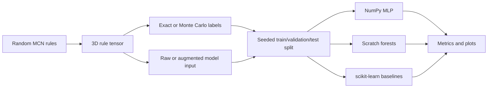

# InfluenceNet Mini

InfluenceNet Mini is an educational implementation for predicting Banzhaf and
Shapley-Shubik style influence in cooperative games. Its main workflow uses
rule-based **Marginal Contribution Networks (MCNs)**; the earlier weighted-
voting workflow remains available for comparison.

The project generates games, calculates exact or Monte Carlo labels, trains
from-scratch and scikit-learn regressors, and saves reproducible metrics and
figures. It is inspired by Kempinski and Kachman's 2025 InfluenceNet paper, but
it is an independent teaching implementation rather than the authors' official
code or a full reproduction of their experiments.

## What the project includes

- paper-inspired MCN rule and value generators;
- exact Banzhaf and Shapley-Shubik style labels for small games;
- vectorized Monte Carlo labels for larger MCNs;
- a from-scratch NumPy MLP, Random Forest, and Extra Trees;
- matching scikit-learn baselines;
- seeded train/test splits, metrics, prediction tables, and plots;
- an older weighted-voting experiment and sampling demo.

## Core idea in one minute

An **agent** is one participant in a cooperative game, and a **coalition** is a
subset of agents acting together. An MCN gives a coalition its value through
rules such as:

```text
{a and b}      -> 3
{a and not c}  -> 1
{b and not c}  -> 2
```

The coalition `{a, b}` satisfies all three rules and therefore has value `6`.
The Banzhaf and Shapley-Shubik measures ask how much each agent changes values
across coalitions or joining orders. The learning task maps a flattened MCN
rule tensor to the resulting vector of per-agent influence scores.

By default, this project counts the **absolute** change caused by an agent, so
both activating and breaking a rule count as influence. Each target vector is
then normalized to sum to one. This convention is important when comparing the
results with signed cooperative-game implementations; the API also supports
signed, unnormalized values.

## Quickstart

Requirements: Python 3.9 or newer, Git, and a terminal.

```bash
git clone https://github.com/mohammad-kawach/power-index-learning.git
cd power-index-learning

python3 -m venv .venv
source .venv/bin/activate
python -m pip install --upgrade pip
python -m pip install -r requirements.txt

python -m unittest discover -s tests -v
```

On Windows PowerShell, create and activate the environment with:

```powershell
py -3 -m venv .venv
.\.venv\Scripts\Activate.ps1
python -m pip install --upgrade pip
python -m pip install -r requirements.txt
python -m unittest discover -s tests -v
```

If PowerShell blocks activation, see
[troubleshooting](docs/troubleshooting.md).

## Reproducing the Reported Results

This is the canonical experiment that produced the MCN dataset and the
committed training, evaluation, and example figures. It creates exact labels,
compares six predictors on both indices, and evaluates all models on dataset
example 0.

| Setting | Canonical value |
| --- | --- |
| Games | 500 total: 400 train, 100 test |
| Agents | 6 |
| Rules per game | 12 |
| Feature set / input width | `raw` / 156 features |
| Rule generator / values | `uniform` / `uniform` |
| Label calculation | exact, absolute marginal changes, normalized per game |
| Monte Carlo samples | **0 used**; not applicable to exact labels |
| Dataset and split seed | 42 |
| NumPy MLP | 20 epochs, batch size 256, 512-256-128 hidden layers |
| scikit-learn MLP | at most 50 iterations with early stopping |
| Trees | 5 per Random Forest or Extra Trees ensemble |
| Test metric | element-wise mean absolute error (MAE) |

The CLI's default `--monte-carlo-samples 10000` value is stored in dataset
metadata but is ignored when `--label-method exact` is selected. No sampling
contributes to the reported labels or MAE values.

Run these commands from the repository root with `.venv` activated:

```bash
python generate_data.py \
  --game-type mcn \
  --num-games 500 \
  --num-agents 6 \
  --num-rules 12 \
  --rule-generator uniform \
  --value-generator uniform \
  --label-method exact \
  --seed 42 \
  --output data/mcn_games.npz

python train_models.py \
  --data data/mcn_games.npz \
  --game-type mcn \
  --mcn-feature-set raw \
  --epochs 20 \
  --sklearn-max-iter 50 \
  --n-estimators 5

python predict.py \
  --game-type mcn \
  --data data/mcn_games.npz \
  --example-index 0
```

The final command produces the committed `example_mcn_*` rule, exact-power,
prediction, and error figures. The training command produces the remaining
`mcn_*` dataset and model figures. Generated CSV reports are ignored by Git, so
the exact numerical leaderboard is preserved here. Lower MAE is better.

| Model | Implementation | Banzhaf MAE | Shapley-Shubik MAE |
| --- | --- | ---: | ---: |
| Random Forest | from scratch | **0.039821** | 0.048048 |
| Extra Trees | from scratch | 0.039865 | **0.046667** |
| Random Forest | scikit-learn | 0.043160 | 0.051812 |
| Extra Trees | scikit-learn | 0.053382 | 0.062097 |
| MLP | scikit-learn | 0.070466 | 0.073790 |
| MLP | from scratch | 0.137822 | 0.136022 |

These numbers were reproduced on 16 July 2026 with:

| Environment | Recorded value |
| --- | --- |
| Hardware | 14-core Apple M3 Max, 36 GB memory |
| OS | macOS 26.3.1, arm64 |
| Python | 3.9.6 |
| NumPy / Pandas | 2.0.2 / 2.3.3 |
| Matplotlib / scikit-learn | 3.9.4 / 1.6.1 |
| Dataset generation | 1.76 seconds |
| Training, evaluation, and plots | 20.24 seconds |
| Example prediction and plots | 2.08 seconds |
| Total wall time | 24.08 seconds |

This is a small deterministic educational benchmark, not the paper's full
experimental protocol. See [experiments](docs/experiments.md) for the complete
configuration, interpretation, alternative commands, and limitations.

## Improving the Results

The preserved benchmark above is intentionally small. For stronger local
results, train on more exact games, use the default augmented MCN features, and
tune tree ensembles on a validation split before reading the final test MAE:

```bash
python generate_data.py \
  --game-type mcn \
  --num-games 5000 \
  --num-agents 6 \
  --num-rules 12 \
  --rule-generator uniform \
  --value-generator uniform \
  --label-method exact \
  --seed 42 \
  --output data/mcn_games_5k.npz

python train_models.py \
  --data data/mcn_games_5k.npz \
  --game-type mcn \
  --mcn-feature-set augmented \
  --validation-size 0.2 \
  --tune-ensembles \
  --tuning-estimators 20 \
  --skip-scratch-ensembles \
  --epochs 100 \
  --sklearn-max-iter 300 \
  --n-estimators 100 \
  --models-dir models/mcn_5k \
  --results-dir results/mcn_5k
```

A local run of this command on 5 August 2026 produced best test MAE values of
`0.030696` for Banzhaf and `0.039740` for Shapley-Shubik, both from
scikit-learn Extra Trees. The full local CSV is written to
`results/mcn_5k/mcn_model_metrics.csv`.

For broader, more paper-like stress tests, vary both rule and value families
instead of optimizing only on the simple all-ones value setting:

```bash
python generate_data.py \
  --game-type mcn \
  --num-games 5000 \
  --num-agents 6 \
  --num-rules 12 \
  --rule-generator gaussian_mixture \
  --value-generator high_variance \
  --label-method exact \
  --seed 42 \
  --output data/mcn_games_gaussian_highvar_5k.npz
```

## Workflow


```mermaid
flowchart LR
    A["Random MCN rules"] --> B["3D rule tensor"]
    B --> C["Exact or Monte Carlo labels"]
    B --> D["Raw or augmented model input"]
    C --> E["Seeded train/validation/test split"]
    D --> E
    E --> F["NumPy MLP"]
    E --> G["Scratch forests"]
    E --> H["scikit-learn baselines"]
    F --> I["Metrics and plots"]
    G --> I
    H --> I
```

An MCN dataset has shape:

```text
(num_games, num_rules, 2 * num_agents + 1)
```

Each rule stores required-agent flags, banned-agent flags, and one value. For
the canonical run the shape is `(500, 12, 13)`, which is 156 features in
`raw` mode. The default `augmented` feature set keeps those raw features and
adds 58 MCN-aware aggregate features for this shape, for 214 total inputs. See
[MCN format](docs/mcn-format.md) for the full schema and generator definitions.

Exact labels enumerate every predecessor coalition and are best for small
games. For larger games, `--label-method monte_carlo` samples coalitions and
joining orders instead. Sampling is faster at large agent counts but introduces
seed-controlled approximation error.

The training script compares the same six model families for each target:

| Model family | Implementations | Role |
| --- | --- | --- |
| MLP | NumPy from scratch and scikit-learn | Learns a dense nonlinear mapping from MCN features to all agent scores |
| Random Forest | from scratch and scikit-learn | Averages bootstrapped regression trees |
| Extra Trees | from scratch and scikit-learn | Averages more randomized regression trees |

## Results at a glance


The tree ensembles perform best on this small benchmark. The chart is generated
from the same metrics reported in the table above.


Each point is one agent in one held-out game; the dashed diagonal represents a
perfect prediction.


Blue cells are required agents, red cells are banned agents, neutral cells are
unused agents, and the green bars show rule values.

The remaining dataset, training, per-agent, and single-example figures are
explained in [experiments](docs/experiments.md#reading-the-figures).

## Generated outputs

The canonical commands create the following main artifacts:

```text
data/mcn_games.npz                  # rule tensor, labels, and metadata
models/mcn_<index>_*.npz or *.pkl   # fitted model artifacts
results/mcn_model_metrics.csv       # validation/test leaderboard
results/mcn_*_history.csv           # NumPy MLP epoch histories
results/mcn_*.png                   # dataset and test diagnostics
results/example_mcn_*.csv           # example predictions and errors
results/example_mcn_*.png           # example rule/prediction figures
```

The datasets, models, and CSV reports are intentionally ignored by Git because
they are reproducible and may be large. PNG documentation figures are
versioned. MCN models have a fixed input width, so prediction must use the same
`num_agents`, `num_rules`, and feature set used during training. `predict.py`
defaults to `--mcn-feature-set auto`, which matches the saved model width when
possible.

The MAE table compares every predicted agent score with its exact target across
the 100 held-out games. Per-agent charts reveal positional bias that a single
average can hide; scatter plots show calibration against the diagonal; training
curves distinguish optimization progress from held-out error.

## Other workflows

For a larger sampled MCN dataset, use Monte Carlo labels explicitly:

```bash
python generate_data.py \
  --game-type mcn \
  --num-games 2000 \
  --num-agents 12 \
  --num-rules 20 \
  --rule-generator coin_flip \
  --value-generator high_variance \
  --label-method monte_carlo \
  --monte-carlo-samples 10000 \
  --seed 42 \
  --output data/mcn_games.npz
```

For the older weighted-voting path, generate a CSV and train with:

```bash
python generate_data.py \
  --game-type weighted \
  --num-games 20000 \
  --num-agents 8 \
  --seed 42 \
  --output data/voting_games.csv

python train_models.py \
  --data data/voting_games.csv \
  --game-type weighted \
  --epochs 300 \
  --sklearn-max-iter 300 \
  --n-estimators 40
```

The [experiments guide](docs/experiments.md) also covers single-index training,
fresh-game prediction, weighted-game prediction, and the Monte Carlo confidence
interval demo.

## Documentation

| Page | Contents |
| --- | --- |
| [Concepts](docs/concepts.md) | Agents, coalitions, MCNs, power indices, and label conventions |
| [MCN format](docs/mcn-format.md) | Rule tensor, generators, archive keys, and shape compatibility |
| [Experiments](docs/experiments.md) | Canonical benchmark, environment, figures, variants, and artifacts |
| [Python API](docs/api.md) | Direct function examples and source layout |
| [Troubleshooting](docs/troubleshooting.md) | Installation, performance, plotting, and reproducibility fixes |

## Project structure

```text
power-index-learning/
├── src/                  # MCN, index, model, feature, scaler, and plot code
├── tests/                # unit tests
├── docs/                 # long-form documentation
├── results/              # versioned figures; generated CSVs are ignored
├── generate_data.py      # dataset CLI
├── train_models.py       # training/evaluation CLI
├── predict.py            # one-game prediction CLI
├── monte_carlo_demo.py   # weighted-game sampling demo
├── requirements.txt      # exact top-level dependency versions
├── CITATION.cff          # software and preferred paper citation
└── LICENSE               # MIT licence for project code and original docs
```

## Academic attribution

The MCN representation, the required/banned rule example, the three rule-
generation families, the three rule-value families, the power-index prediction
task, and the 512-256-128 neural-network layout are adapted from:

> Benjamin Kempinski and Tal Kachman. “InfluenceNet: AI Models for Banzhaf and
> Shapley Value Prediction.” In *Intelligent Systems and Applications*
> (IntelliSys 2025), Lecture Notes in Networks and Systems, vol. 1553,
> pp. 1–23. Springer Nature Switzerland, 2025.
> [doi:10.1007/978-3-031-99958-1_1](https://doi.org/10.1007/978-3-031-99958-1_1)

The publication is also included locally as
[InfluenceNet AI Models for Banzhaf and Shapley Value Prediction.pdf](InfluenceNet%20AI%20Models%20for%20Banzhaf%20and%20Shapley%20Value%20Prediction.pdf).

This repository's exact enumeration, vectorized Monte Carlo implementation,
explicit absolute/normalization options, NumPy training code, scratch tree
ensembles, scikit-learn comparisons, command-line workflow, archive format,
tests, plots, and weighted-voting path are its own educational implementation
and modifications. The numerical parameters used for the low- and high-
variance generators are also repository-specific choices.

## Licence and citation

Project code and original repository documentation are available under the
[MIT License](LICENSE). The included paper is third-party material and is not
covered by that licence; see [Third-Party Material](THIRD_PARTY_NOTICES.md).

If you use the repository, GitHub can generate a citation from
[`CITATION.cff`](CITATION.cff). Its preferred citation is the InfluenceNet paper
above, while the software metadata identifies Mohammad Kawash as the repository
author.
